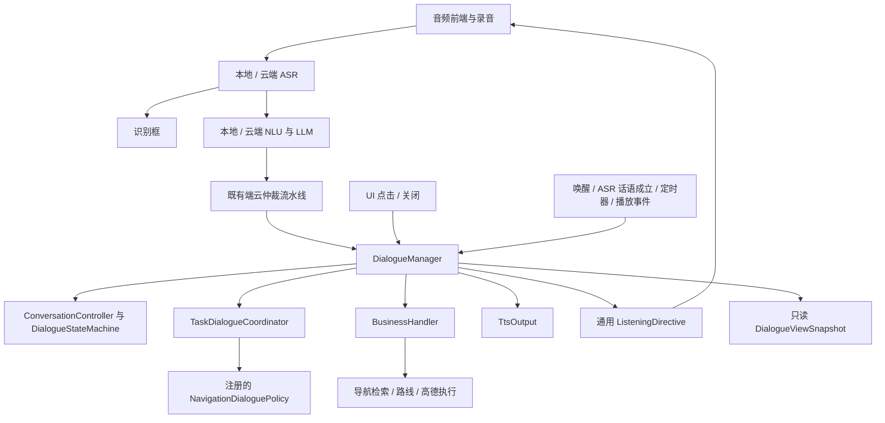

# DM 与导航多轮对话架构方案

- 日期：2026-09-22
- 状态：首期代码与复评修复均在 PR #123；P1–P4 的代码与自动化验证已完成，真机组合回归仍待执行。详见 [2026-09-22 复评](architecture-review-2026-09-22.md)。
- 基线：dev 的导航实现及已合并 PR #122 的单一交互状态源。
- 范围：先接入导航候选选择，保留现有端云仲裁、ASR 准入和独立 TTS；为后续其他业务多轮复用边界。

## 1. 设计决策

客户端 DM 是用户当前对话任务的权威拥有者。DM 管理期待回答、任务切换、取消、超时和采用；导航领域模块管理候选、地点匹配、路线与地图应用执行。

现有 DialogueStateMachine 继续管理交互阶段。新增任务对话管理，不向它添加 NAVIGATION_WAITING 等业务状态，也不重新引入 VoiceSession 那样的第二套交互状态机。

语义理解只能产生提议；仲裁通过后，DM 校验当前轮和任务版本，再推进任务和发起业务处理。云端理解阶段不得删除客户端仍然有效的候选。

断线结束当前请求和待选任务；不重放音频、不补执行、不自动重试导航动作。重新连接建立新连接代次，不恢复旧待选任务。已经发给地图应用的动作不会因断线被撤销，也不声称可远程撤销。

## 2. 现状与迁移原因

| 当前组件 | 当前职责 | 问题 |
|---|---|---|
| DialogueStateMachine / ConversationController | 交互阶段、capture 准入、当前 turn | 没有期待回答和任务上下文 |
| NavigationSession | 候选、selectionId、路线、handoff | 同时承载待选对话和导航业务状态 |
| NavigationDialogService | 云端候选缓存、理解与消费选择 | select/cancel 在结果被采用前删除候选 |
| MainViewModel | 弹窗、120 秒候选定时器、采用/撤销发送 | UI 层承担任务生命周期 |
| RecordingCoordinator | 麦克风、追问计时、导航 30 秒策略 | 录音层需要认识导航候选 |

现有 selectionId、candidateId、坐标一致性检查及选择采用确认可复用。云端名称/序号解析继续保留为导航语义能力。

## 3. 目标结构



DialogueManager 是协调门面，组合现有交互状态和新的任务状态。它不解析 ASR 文本，不做候选优先级仲裁，不持有高德 SDK 或车辆状态。任务策略通过组合根注册，不在 VoiceEngine 中增加导航分支。

NLU 在开始一轮时获取只读上下文快照，生成带上下文身份的语义。DM 对最终输出重新校验，快照本身不授予执行权限。

## 4. 模块边界

| 模块 | 拥有 | 不拥有 |
|---|---|---|
| voice-core/dialog | 通用交互状态、任务契约、任务协调、计时规则 | 导航地点匹配、高德 URI、Android UI |
| navigation-dialog（建议新增纯 Kotlin 模块） | 导航任务策略、不可变候选数据、选择一致性校验 | 麦克风、TTS 播放、地图应用启动 |
| business-core + app 导航适配器 | 执行已采用导航命令，返回执行结果 | 追问窗口和当前对话轮 |
| 云端 navigation-domain | 只读上下文解析、序号/名称匹配、地点检索结果准备 | 客户端任务完成决定、提前消费候选 |
| RecordingCoordinator | 执行监听指令、采集及释放录音资源 | 导航专用时长、待选任务判断 |
| MainViewModel | UI 快照映射、传递用户事件 | 任务计时、任务采用确认、候选生命周期 |
| GatewayClient / 协议适配器 | 传输 / 上下文协议编码与解码 | 对话策略 |
| TtsOutput | 合成、缓存、播放、真实播放生命周期 | 业务任务完成决定 |

VoiceEngine 保留装配和输入接线，向 DM 交付事件。已有 ResponseDispatcher 应逐步成为 DM 输出效果的适配器，避免绕过 DM 直接修改任务。

## 5. 状态模型：两个正交维度

### 5.1 交互维度

继续使用 DORMANT、AWAKE、THINKING、SEMANTIC_PROCESSING、RESPONDING、SPEAKING、FOLLOW_UP_LISTENING。

VAD 只产生采集事实；ASR 的 turnEstablished 或有效 NLU 才准入新轮。识别字幕即时输出，不等待仲裁。新轮准入引起的停播沿用当前规则。

### 5.2 任务维度

首期每次交互最多一个等待回答的任务，不做任务栈或多任务恢复。

```text
无任务 -- 采用候选结果 --> WAITING_INPUT
WAITING_INPUT -- 采用有效选择 --> EXECUTING
EXECUTING -- 地图应用接受拉起 --> COMPLETED
EXECUTING -- 明确执行失败 --> FAILED
WAITING_INPUT -- 用户取消 --> CANCELLED
WAITING_INPUT -- 等待/交互期限到 --> EXPIRED
WAITING_INPUT -- 采用新检索或其他域任务 --> REPLACED
WAITING_INPUT -- 断线/退出前台/进入闲聊 --> ABORTED
```

终态发布一次结束事件后从活动槽移除；可在遥测记录原因，不持久化恢复执行。

用户正在回答时任务仍然是 WAITING_INPUT，交互状态为 THINKING。避免重复增加一个任务级 THINKING。此时暂停等待回答的计时，保留交互绝对上限及思考超时。

任务快照建议包含：

```kotlin
data class TaskIdentity(
    val interactionId: String,
    val taskId: String,
    val revision: Long,
)

data class DialogueTask(
    val identity: TaskIdentity,
    val domain: String,
    val status: TaskStatus,
    val expectation: InputExpectation,
    val originTurnId: String,
    val context: DomainTaskContext,
)
```

上述为契约草图。DomainTaskContext 使用模块声明的类型化数据，通用 DM 不读取导航字段；导航上下文保存 selectionId、candidateId 和候选快照。NavigationSession 迁移后只保留 trip/handoff，候选由导航任务上下文唯一持有，UI 和上行协议都读取它。

区分身份：turnId 关联一次话语；interactionId 关联一次连续交互；taskId 跨多轮保持；revision 防止旧列表选择和旧定时器作用于新列表；connectionEpoch 隔离断线前后云端结果。

## 6. 事件、策略与效果

入口包括 SemanticWinner、UserSelection、DismissTask、PlaybackStarted/Ended/Failed、TimerExpired、ConnectionLost、AppBackgrounded、ChatEntered、BusinessCompleted。

所有入口进入客户端串行事件通道。通道有容量上限；过载显式失败当前请求，拒绝继续提交执行效果，不能静默丢弃取消、断线或超时事件。优先复用现有锁内状态转换、锁外 FIFO 效果机制。

每次处理分两步：在串行域内校验身份并更新状态，产生不可变效果；在状态锁外调用 UI、TTS、通信或业务。异步结果携带 taskId/revision/effectId，返回时再核验，过期结果不得推进新任务。

NavigationDialoguePolicy 接收已理解的语义与任务快照，返回以下之一：继续等待、完成选择、取消、替换、非本任务输入。它不接收原始 PCM，也不直接启动地图。

DM 的效果包括 PresentTask、Speak、SetListeningPolicy、PublishContext、ExecuteBusiness、EndTask。业务执行前再次核验效果所属任务；同一活动任务已经进入 EXECUTING 后拒绝第二次选择。采用进程内状态防重入，不建立持久化动作账本，也不承诺崩溃后的 exactly-once。

UI 点击和语音选择进入同一个 DM 采用入口。点击没有伪造 ASR turn 的必要，使用 taskId/revision/candidateId；语音入口额外检查 turnId。两者竞争时只允许首个有效选择改变 WAITING_INPUT。

## 7. 导航二轮完整流程

1. 用户说“导航去机场”，端云并发处理，ASR 独立上屏。
2. 云端返回候选语义提议及候选身份，通过原有仲裁后交 DM。
3. DM 校验当前轮，采用候选，创建导航任务，发布弹窗与上下文，请求 TTS 播报选项。
4. 播放完成/失败事件到达，DM 为任务启动回答窗口并发通用监听指令；TTS 无输出也必须产生可收口事件。
5. 用户说“第二个”，请求携带固定任务快照。NLU 输出 SelectCandidate(taskId, revision, selectionId, candidateId)，不消费候选。
6. 该语义通过仲裁后，DM 校验当前 turn、任务状态、revision 与候选归属；导航策略验证目标，DM 转 EXECUTING 并关闭弹窗。
7. 执行适配器用本地候选快照中的坐标打开高德，结果返回 DM，标记 COMPLETED 或 FAILED。

COMPLETED 只表示地图应用接受拉起，不能称为导航已实际行驶或高德正在持续引导。

多目的地仍按既有产品约定：每个地点选最合适结果，直接打开路线规划页，不引入逐站二轮选择，也不自动开始导航。

## 8. 端云上下文协议

客户端任务是权威；云端只缓存不可变候选上下文用于理解。保留现有 selectionId/candidateId，逐步增加 taskId、revision、interactionId、connectionEpoch 和协议能力声明。

### 推荐首期形式

- 候选采用后发送 context_publish，包含任务身份与候选快照；服务端按会话所有权及容量/大小限制校验。
- 每次 audio_start 固定携带该任务身份；本轮结束前不可改读“当前全局 selectionId”。
- 服务端解析选择时仅读取匹配的上下文，返回同一任务身份和 candidateId；不删除、不更新为已执行。
- 客户端任务终止时发 context_close，必须携带确切 taskId/revision，不能用空 ID 清除任意最新任务。
- context_close 仅清缓存，不是执行指令。不依赖它成功送达才能阻止端侧过期执行。
- 缓存缺失返回 CONTEXT_MISSING，客户端结束任务并提示重新搜索；不自动恢复旧任务或补跑选择。
- 连接断开清除客户端待选任务；新 connectionEpoch 拒绝旧缓存/结果。服务端 TTL 只用于垃圾回收。

context_publish 与随后 audio_start 在同一有序连接上发送，服务端在顺序入口完成上下文登记后再调度异步识别。若实现无法保证这一点，需要显式 context_ready 确认，缺少上下文时失败，不能退回其他旧列表。

云端返回的候选 ID 必须在客户端当前列表中；执行坐标以本地采用快照为准。云端/模型不得仅凭提供一组坐标绕过二轮选择关联检查。

### 兼容迁移

先增加能力协商 task_dialog_v1。新旧客户端走独立路径，旧路径暂保留原协议；新客户端必须禁止缺少任务身份时回退“最近列表”。服务端先部署兼容入口，客户端再切换，最后删除旧空 ID 撤销与 legacy selection fallback。逐步发布期间分别记录两种路径，不能宣称旧路径已经具备新约束。

## 9. 计时与打断策略

| 场景 | 首期策略 |
|---|---|
| 普通追问 | 播放完成后 10 秒 |
| 导航期待选择 | 播放完成后 30 秒 |
| 一次连续交互 | 沿用 60 秒绝对上限，重复播报不延长它 |
| ASR 准入新轮 | 暂停回答计时，思考超时沿用现有配置 |
| 单纯 VAD/ASR 字幕 | 不推进任务，不停播，不重置对话期限 |
| 序号越界/名称歧义 | 保留任务，澄清后重开回答窗口，仍受绝对上限约束 |
| 点击弹窗外/说取消 | 结束任务、关弹窗、结束当前等待交互 |
| 采用新导航检索 | 结束旧选择，等待新检索结果，不使用旧列表补全 |
| 采用其他域请求 | 首期替换旧选择任务，不做后台任务恢复 |
| 进入闲聊/退出前台 | 结束待选任务，录音按所属模式处理 |
| 断线 | 当前云端请求失败，待选任务结束，无重放和补执行 |

这些时长是迁移默认值，可配置。DM 拥有期限和策略，RecordingCoordinator 只执行 Listen(enabled, policyVersion) 一类通用指令；录音最大时长等硬件保护仍属于录音层。

定时器事件携带任务身份和 timerGeneration。处理时核验状态、期限、代次，迟到旧定时器直接忽略。定时器所在执行器可以独立，但不得自行决定导航任务过期。

## 10. 异常与竞态示例

| 事件交错 | 必须表现 |
|---|---|
| 云端解析“第二个”，端侧本地语义胜出 | 选择提议未采用，不因解析删除候选；若采用的是其他域请求，由 DM 明确替换任务 |
| 旧列表的语音结果晚于新列表 | revision 不匹配，拒绝执行，不清新列表 |
| 用户关闭弹窗后收到选择结果 | 无活动任务，拒绝执行 |
| 点击与语音选择同时到达 | 首个采用，后者被任务状态拦截 |
| 旧 context_close 晚于新 context_publish | 只删除匹配旧版本，不能清新任务 |
| 发出导航命令后连接断开 | 不再发第二次；已发生地图拉起不被伪装成“未发生” |
| 执行失败/结果无法确认 | 终止本次执行并提示可重新发起；禁止自动重试 |
| 老业务回调晚到 | 可记录实际结果，不修改新任务或触发新播报 |

## 11. 开发拆分与验收

### P1：修复云端提前消费（已完成）

将 resolve/select/cancel/fresh-search 拆成只读理解与采用后的上下文处理；新增任务身份的精确关闭。先补“结果落败、端侧拒绝、旧关闭迟到”的测试。兼容旧协议的消费语义单独隔离，切换前不混用。

### P2：建立客户端任务 DM（已完成首期）

新增通用 TaskDialogueCoordinator 和 NavigationDialoguePolicy。接入已采用语义、点击、取消，迁移候选所有权；保留现有交互状态机。验证同一列表跨多个 turn、列表替换、并发点击/语音只执行一次。

### P3：统一任务收口和聆听策略（已完成首期）

移除 MainViewModel 导航定时器及 RecordingCoordinator.hasNavigationCandidates。DM 统一发列表、期限和监听效果。验证播放完成/失败、思考超时、旧 timer、新轮、后台、进入闲聊各路径。

### P4：端云上下文切换（已完成新路径，兼容窗口保留）

能力协商后启用新身份协议，云端只读候选缓存；实现断线结束、CONTEXT_MISSING、精确 context_close，删除新路径的 legacy fallback。补 schema fixtures 和 Classic/Omni 两种业务链回归。

### P5：清理与真机验收（进行中）

清理 NavigationSession 的重复候选状态及旧协议接线。覆盖“机场→序号”“机场→名称”“越界→再选择”“取消”“改搜其他地点”“空调插话”“双列表旧结果”“断线重连”“退出高德返回”“多目的地路线页”。

门禁包括相关 Kotlin/Java 单测、Android lint/build、现有覆盖率和协议 fixture 检查。时序测试使用可控时钟及显式完成信号，不用固定 sleep 作为处理完成证明。真机重点确认播报后聆听、弹窗消失、一次拉起和断线无补执行。

复评 F1–F6 已修复并补齐自动化组合回归。当前剩余项是上述真机矩阵、分阶段发布验证，以及兼容期结束后删除旧协议；自动化通过仍不能代替真实地图、真实断网与云模型验收。

## 12. 首期不引入

不引入通用工作流引擎、持久化任务恢复、动作重试账本、复杂任务栈或由 LLM 自行决定状态转换。其他业务按需实现同一任务策略接口，至少有第二个真实使用场景后再提炼更多通用能力。
