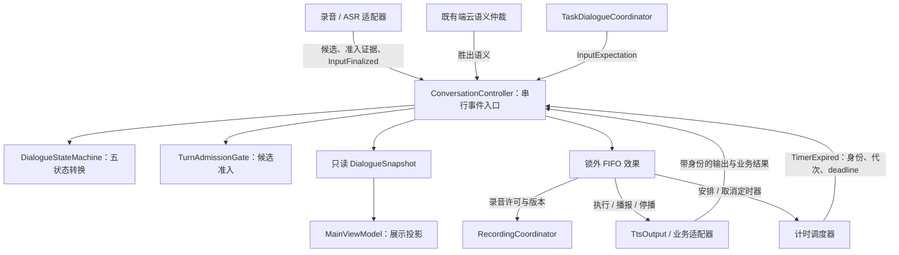
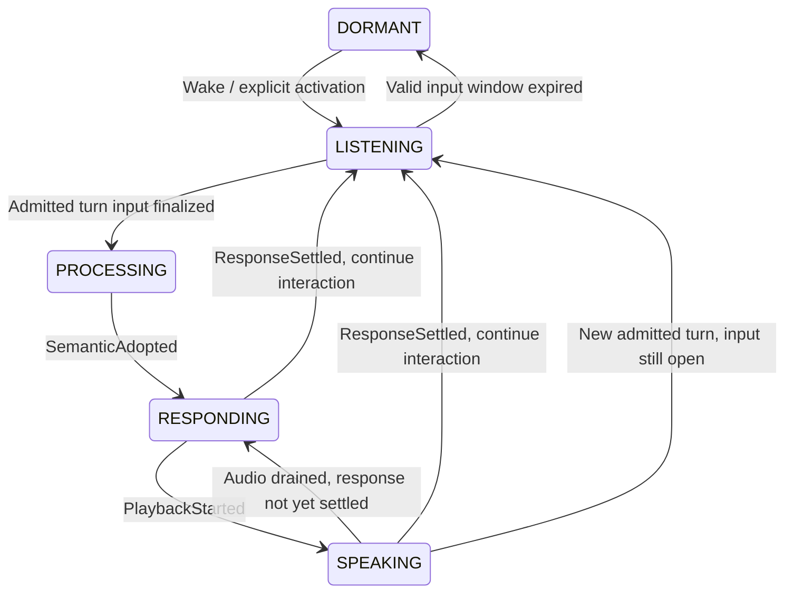

# DialogueState 评估与演进方案

日期：2026-09-29。状态：设计定稿；P0/P1 与首期 P2 已在 `codex/dialogue-five-state-2026-09-29` 实施，P3 按需求延后。修订版：统一聆听状态。

实施说明：五状态、独立 `InputFinalized`、同轮阶段守卫、固定处理计时、跨阶段 interaction 硬期限、监听就绪后计时、窗口代次及旧 capture 退役已落地。TTS 已补播放准备超时，且流式播放完成必须等待语义 completion 后才收口；中断事件携带新轮替换、仅停播、交互关闭等原因。专门的长播报停滞监测仍需播放进度数据与期限校准；普通交互目前由硬期限兜底。以下第 4 节“当前代码”记录实施前基线，不代表改造后的现状。

评估基于改造前的客户端状态机、控制器、录音、输出与任务管理代码，以及厂商公开资料。评估本身未执行真机体验；下文的风险是源码路径分析，不能等同于已经在线上观测到故障。实施后的自动化测试状态以本分支 CI 为准。

## 1. 结论

现有架构适合当前“单个前台交互、端云并行理解、有限连续对话”的车载助手，建议保留并演进。主要问题是状态定义混合了用户交互与内部处理进度，以及同轮事件、期限和输出收口规则不够完整。

采用五个交互阶段：`DORMANT / LISTENING / PROCESSING / RESPONDING / SPEAKING`。等待用户开口与接收用户话语都属于 LISTENING，不设 READY，也不再定义 WAITING_FOR_SPEECH/RECEIVING_SPEECH 之类的聆听子状态枚举。控制器依据已有的轮次准入事实与新增的输入收口事件管理计时。

继续由 `ConversationController` 统一推进状态；`DialogueStateMachine` 是它内部的转换组件。聆听原因和输入许可是策略参数，业务任务仍有独立的任务状态，二者都不构成第二套交互生命周期。

应优先补齐同轮阶段守卫、固定截止时间和输出收口，再迁移状态命名。普通指令模式和现有 S2S 闲聊暂时保持各自生命周期；未来统一展示和资源仲裁，不能直接共用普通指令轮次。

## 2. 已有设计中应保留的部分

- **候选与有效轮分离**：VAD 只创建 capture，ASR 话语成立或有效语义才准入 turn。噪声不能直接抢占旧轮；这对车内音乐、乘客交谈和回声尤其重要。
- **身份分层**：`interactionId` 关联连续交互，`turnId` 关联一次有效话语，任务另有 `taskId/revision`，播放另有 `playbackId`。这些概念不能合并。
- **仲裁与采用分离**：仲裁决定候选胜出，控制器再判断它是否仍可用于当前交互。不要为了退出交互而改变端云竞争规则。
- **播放驱动反馈**：真实播放开始才进入 SPEAKING；播完才打开追问窗口。空输出、合成失败也已有部分收口路径。
- **任务与交互分离**：`TaskDialogueCoordinator` 负责 WAITING_INPUT/EXECUTING；导航选地点不应变成 `NAVIGATION_WAITING` 之类的顶层交互状态。
- **串行变更、锁外效果**：控制器已有锁内更新、FIFO 回调机制，可继续承载本提案。

上述规则分别见 [状态机](../AutoVoice/voice-core/src/main/kotlin/com/autovoice/voicecore/dialog/DialogueStateMachine.kt)、[控制器](../AutoVoice/voice-core/src/main/kotlin/com/autovoice/voicecore/dialog/ConversationController.kt)、[任务协调器](../AutoVoice/voice-core/src/main/kotlin/com/autovoice/voicecore/dialog/TaskDialogueCoordinator.kt)和 [TTS 输出](../AutoVoice/tts/src/main/kotlin/com/autovoice/tts/TtsOutput.kt)。

## 3. 主流产品公开资料能说明什么

大多数厂商不公开完整的内部状态机。以下严格区分 SDK 状态、公开用户行为和本方案的工程推论；不把产品功能描述当成内部实现。

| 产品与证据类型 | 公开事实 | 对本项目的启发 |
|---|---|---|
| Alexa Auto，公开 SDK 契约 | DialogState 明列 IDLE、LISTENING、EXPECTING、THINKING、SPEAKING、FINISHED；THINKING 指请求输入已经完成；FINISHED 可以只是单条 Speak 指令结束 | 区分接收话语与处理请求；期待回答应有明确语义；一段音频结束不必然等于整个回复结束 |
| Alexa Automotive，公开交互规范 | 顶层注意力状态是 Idle、Listening、Thinking、Speaking；Listening 内描述 Start/Active/End 三个阶段 | 可以统一对外使用 LISTENING；内部事实足以驱动计时，不要求额外 READY 枚举 |
| Siri，官方用户指南 | 可调整等待用户说完的 Pause Time，也可要求说出唤醒词才打断 Siri | 端点检测与打断是独立策略，不应由一个 THINKING 或 SPEAKING 枚举隐式决定 |
| Gemini Live，官方用户指南 | 支持说话打断；Hold/恢复、结束会话，以及麦克风静音但助手继续播报 | 会话是否存在、是否允许输入、是否在输出是不同维度 |
| Android Auto，官方用户指南 | 支持唤醒词、屏幕麦克风和方向盘按钮启动，也有 Gemini Live 入口 | 入口来源与交互模式应作为策略输入，不能把所有入口都视为同一种新会话 |
| 小鹏，2026 G9 配置与官方能力介绍 | 配置包含四音区、离线对话、连续对话、并行指令；Xmart OS 官方介绍包含有效指令打断和无效指令过滤 | 保留有效话语准入；多音区需要归属和资源仲裁，不能靠继续添加全局枚举解决 |

来源：[Alexa Auto SDK](https://alexa.github.io/alexa-auto-sdk/docs/aasb/alexa/AlexaClient/#dialogstate)、[Siri 辅助功能](https://support.apple.com/en-nz/guide/iphone/iphaff1d606/ios)、[Gemini Live](https://support.google.com/gemini/answer/15274899?hl=en)、[Android Auto](https://support.google.com/androidauto/answer/6348083?hl=en)、[2026 G9 配置](https://www.xiaopeng.com/g9_2026/configuration.html)、[Xmart OS](https://www.xpeng.com/intelligent/xmartos)。查阅日期为 2026-09-29；Alexa SDK 用作公开工程参考，并不代表所有当代 Alexa 产品内部实现。手机功能受系统、语言和设置影响；车载能力受车型和版本影响。

工程判断：本项目应借鉴“交互阶段清楚、输入与输出可并行、期待回答有策略、异步事件有身份”的原则，无需复刻任何一家状态枚举或等待秒数。

补充来源：[Alexa Automotive 唤醒与注意力状态规范](https://developer.amazon.com/en-US/docs/alexa/alexa-auto/invoking-alexa.html)。其中 EXPECTING 的 SDK 含义是期待用户回答，不等于用户尚未开口。本方案的单一 LISTENING 与该交互规范一致，但有效话语的准入规则仍沿用本项目约束。

## 4. 当前代码的具体问题

### 4.1 话语成立被当成话语结束：用户还在说，状态已是 THINKING

`DialogueStateMachine.onSpeechCommitted()` 在话语准入后立即进入 THINKING。服务端 `IflytekIatAsrProvider` 在首次非空识别文本时就发出 `onTurnEstablished()`，不要求最终帧；客户端随后调用 `confirmTurn()`。`MainViewModel.dialogueToUiPhase()` 把 THINKING 映射为 UNDERSTANDING。

因此源码允许“用户刚说到一半，界面已经理解中、思考计时已经开始”的时序。该行为不表示麦克风一定停止，但状态含义与实际说话过程不一致。当前本地命令 SDK 没有独立 ASR，其最终语义准入则可能发生在采集结束后，两条链路的同一状态因此含义不同。

建议拆分两个事件：

- `TurnAdmitted`：这确实是对助手说的一轮话，允许抢占旧输出。
- `InputFinalized`：这一轮输入已经收口，开始等待最终处理结果。

不能用一次 VAD SpeechEnd 直接替代 InputFinalized：当前 capture 可以包含多个 VAD 段。应由采集/ASR 适配层汇总最终端点、按钮提交或最终音频收口，产生一次 turn 级事件。文本仍只用于字幕/NLU。

### 4.2 同轮迟到事件可使状态倒退

`forTurn()` 只检查 turnId。`ConversationController.setPending(true)` 对当前轮仍然有效，不检查是否已采用最终语义。因此以下调用序列会进入错误阶段：

```text
confirmTurn(t) → onFinalSemantic(t) → onPlaybackStarted(t)
              → setPending(t, true)
最终状态：SEMANTIC_PROCESSING
预期状态：SPEAKING
```

同理，FOLLOW_UP_LISTENING 中的迟到 pending 可重新进入处理阶段。这不一定会由当前网关的正常顺序触发，但状态机的公开入口确实允许它，端云并发或未来适配器不能只靠正常顺序保证正确。

已有播放适配器会校验 playbackId、过滤旧播放和重复事件，不能称系统完全没有播放防护。缺口在于：状态机本身未完整限定当前阶段可以接受哪些同轮事件。应明确阶段守卫与幂等结果，迟到 pending 只记录诊断，不再改变交互阶段。

### 4.3 思考期限可以被重复通知延长

`VoiceEngine.onConversationState()` 每次回调都会取消并重建思考定时器。重复 pending 会再次发出相同状态回调；即便 StateFlow 不发布相等值，`onState` 回调仍会调用。因此“60 秒思考超时”目前更接近“最后一次处理阶段通知后 60 秒”。

建议首次 InputFinalized 时固定处理截止时间；重复事件、pending 更新或 UI 重绘不得续期。用单调时钟保存 deadline，定时器只是唤醒器，事件处理时再次检查身份、代次与期限。

### 4.4 交互绝对上限只在等待状态生效

`DialogueListeningController.update()` 只在 AWAKE/FOLLOW_UP_LISTENING 安排定时器。进入处理或播报就取消它；60 秒仅用于下次等待窗口的剩余额度。因此它不能保证“从唤醒起所有阶段最多 60 秒”。例如第 50 秒进入 SPEAKING 后长时间不结束，不会在第 60 秒由此控制器关闭交互。

建议把现有文档约定的 60 秒真正做成独立 interaction deadline。保持配置值，但这会收紧当前实际行为，必须验证长输入和长回复被截断的体验。它应在所有普通交互阶段生效；若产品希望长回复播完再退出，应另行明确为软预算，不能继续称为绝对上限。Live 模式不直接复用此值。

### 4.5 RESPONDING 有必要，但缺少统一的最长等待保障

它表达“语义已采用，业务/音频尚未交付”，对异步 TTS 是有意义的，不能简单删除后仍让 THINKING 超时处理一切。现有思考计时仅覆盖 THINKING/SEMANTIC_PROCESSING，聆听计时也不覆盖 RESPONDING。

已有合成失败、空文本和 NO_OUTPUT 的收口，但若输出请求没有开始、完成或失败通知，交互层没有统一准备超时。这是生命周期保障缺口，不代表每条 TTS 路径都没有网络超时。

建议输出请求必须注册可追踪身份，最终返回 Completed/Failed/Skipped/Interrupted 之一，并补输出准备与播放停滞期限。Interrupted 要带原因：新轮替换、用户只停播、交互关闭的后续行为不同。

### 4.6 枚举并非完整的输入能力说明

`RecordingCoordinator.onPlaybackStage()` 已单独开启开放麦克风打断，说明 SPEAKING 并不等于禁止输入。AWAKE 与 FOLLOW_UP_LISTENING 在 UI 和监听代码中则大量被同等处理。`InputExpectation` 已经存在于任务层，不需要再在顶层复制一个任务状态。

建议把“是否能收输入”显式作为策略，把唤醒后等待、自由追问、任务回答作为聆听原因。录音资源事实继续由录音层拥有。不要让 UI 仅看到 LISTENING 就假设麦克风已经成功打开。

## 5. 推荐近期状态模型

### 5.1 五个交互阶段

| 新阶段 | 准确定义 | 原状态迁移 |
|---|---|---|
| DORMANT | 没有活动普通交互；仍可按能力监听唤醒词 | 保留 DORMANT |
| LISTENING | 正在等待或接收用户输入；准入前后都保持此状态 | 合并 AWAKE、FOLLOW_UP_LISTENING，并接回原 THINKING 中用户尚未说完的部分 |
| PROCESSING | 当前 turn 的输入已收口，等待最终语义采用 | 合并 THINKING、SEMANTIC_PROCESSING 的处理部分 |
| RESPONDING | 最终语义已采用，业务反馈/音频尚在准备或交付中，但未实际播放 | 保留内部阶段，不单独增加 UI 动画 |
| SPEAKING | 当前回复的音频正在实际播放 | 保留 SPEAKING |

UI 默认仍只有四种视觉状态：DORMANT→空闲，LISTENING→聆听，PROCESSING/RESPONDING→处理中，SPEAKING→播报。诊断页可以显示详细阶段；阶段不应由 UI 反向驱动。

```kotlin
// 契约草图，不是本次已经实现的接口。
enum class DialogueState { DORMANT, LISTENING, PROCESSING, RESPONDING, SPEAKING }
enum class ListenReason { INITIAL, FOLLOW_UP, TASK_REPLY }
enum class InputPolicy { CLOSED, OPEN, BARGE_IN }
```

`ListenReason` 回答“为什么继续听”，不回答“用户说到哪一步”。同一次聆听中，用户开口不会改变 reason。`InputPolicy` 回答“允许哪类输入”，也不能用来编码等待/正在说话。

快照继续使用现有 `state` 字段，不额外增加一份 phase。`turnId` 改为仅引用尚未收口的活动轮：唤醒后为 null；准入后有值；回复收口时清空。上一轮身份保留在遥测/任务上下文中，不继续作为可采用结果的当前轮。这个语义变化需要逐一检查现有 isCurrentTurn/isVisible 的调用者。

在 LISTENING 中，没有活动 turn 时允许无输入窗口，有活动 turn 时取消该窗口并等待 InputFinalized。这由轮次拥有关系推导，不新增 `isWaiting`、`isReceiving` 或另一套聆听状态。

### 5.2 组件边界与数据拥有者



图中的业务和任务接线通过现有 VoiceEngine/AppDialogueManager 适配，不把业务执行器或导航实现注入纯状态机。

| 组件 | 唯一拥有的数据 | 职责 |
|---|---|---|
| ConversationController + 内部状态机 | interaction、活动 turn、当前 state、聆听策略、各类 deadline 的有效身份 | 校验事件、原子更新、产生效果；对外仅一个状态源 |
| TurnAdmissionGate | capture 候选、准入证据、候选是否已输入收口 | VAD 不抢轮；收口早于准入时保存事实；成功准入后把事实移交活动 turn |
| 录音/ASR 适配器 | 实际采集、端点与录音资源 | 把多段 VAD、按钮提交等归一成一次 InputFinalized；报告设备就绪与失败 |
| 计时调度器 | 已调度任务的句柄 | 按控制器指令安排回调；不能自行决定退出、续期或任务过期 |
| TaskDialogueCoordinator | taskId/revision、业务期待与任务状态 | 提供通用 InputExpectation，校验选择；不重建交互状态 |
| TtsOutput | playbackId、实际播放资源与音频片段 | 过滤旧播放回调；输出真实生命周期事实 |
| UI | 渲染数据 | 展示状态、字幕和音量；不以识别文本或波形改变 turn/state |

控制器的最小内部模型如下，均为设计草图：

```kotlin
data class ActiveTurn(
    val turnId: String,
    val admittedAtMs: Long,
    val inputFinalizedAtMs: Long?,
    val semanticAdopted: Boolean,
    val responseId: String?,
)

data class ListenWindow(
    val generation: Long,
    val deadlineMs: Long,
    val taskIdentity: TaskIdentity?,
)
```

`ActiveTurn?` 是当前轮事实，`ListenWindow?` 是可失效的定时资源，不是两个交互状态。回复处理期间 activeTurn 继续存在；回复收口时清空并新建聆听窗口。首次监听未就绪前暂不创建窗口，设备就绪等待仍有独立期限。内部模型通过单一 reducer/转换入口更新；公开快照只投影其必要字段。

候选与活动 turn 的 inputFinalized 事实按所有权移交；准入后重复收口事件直接交活动 turn 校验，不能两边各存一份再猜谁正确。回复收口后，旧 capture 不得被重复准入；下一次有效输入必须使用新的 captureId。播报期间新建且尚未确认的另一 capture 可以保留，随后仍按新轮规则准入。

### 5.3 输入与输出并行

`InputPolicy` 是控制器发出的许可，录音层返回带版本的实际运行反馈。有效输入能力为“策略许可 ∩ 前台/模式条件 ∩ 麦克风与 AEC 实际能力”。BARGE_IN 只有在现有音频链支持时开启；不因增加枚举就宣称完成全双工。

SPEAKING+BARGE_IN 时，VAD 新候选仍留在准入层；确认后原子采用新 turn、撤销旧输出资格，再在锁外停止旧播放。若新输入仍在继续，转 LISTENING；若输入已收口，转 PROCESSING；若准入证据就是最终有效语义，可以直接转 RESPONDING。候选未成立不改变旧轮。

本方案仅表达现有“播报期间接收候选，确认后打断”的能力，不表示两个有效前台 turn 同时运行。PROCESSING/RESPONDING 中是否允许开放麦克风同样由输入策略和资源能力决定；显式按钮/唤醒打断走独立入口，不借迟到 pending 改变状态。

### 5.4 正常转换



图展示主要路径。各活动阶段均可被显式关闭、交互期限或模式切换结束；有最终语义的准入可直接到 RESPONDING；新轮也能替换 PROCESSING/RESPONDING 中的旧轮。所有跳转都必须满足下表守卫。

最常见的一段事件序列：

```text
唤醒               LISTENING，activeTurn=null，麦克风就绪后开无输入窗口
VAD 候选开始        LISTENING，仅准入层增加 capture，无输入窗口继续
ASR 确认有效话语    LISTENING，设置 activeTurn，撤销无输入窗口
用户继续说         LISTENING，不重置任何 deadline
该轮输入最终收口   PROCESSING，设置固定处理 deadline
最终语义被采用     RESPONDING，设置回复身份、准备输出
音频真实播放       SPEAKING
整个回复收口       LISTENING，清活动 turn，以新 generation 开追问窗口
追问无人响应       DORMANT
```

ASR 确认有效话语时 state 完全可以不变，但模型和定时效果必须更新。计时与停播不能仅依赖 `state` 枚举变化，也不能依赖 UI 是否收到 StateFlow 通知。

### 5.5 事件和守卫

| 事件 | 条件与动作 |
|---|---|
| Wake / ExplicitActivation | 明确启动来源；新交互撤销旧身份与输出资格。不要把闲聊模式的资源入口混进普通 turn |
| CaptureOpened / CaptureRejected | 只改变准入候选；不改当前 turn，不续期，不由字幕判定有效 |
| TurnAdmitted | 候选属于当前准入代次；同一 turn 重复证据幂等。先设置活动轮、撤销旧输出资格和无输入窗口，再发停播效果；输入未收口则保持/转 LISTENING |
| InputFinalized | 绑定 capture/turn，仅接受第一次。未准入时只在候选层记录，不抢占旧轮；已准入且尚未采用语义则转 PROCESSING |
| ProcessingProgress | 仅更新当前请求处理进度；最终语义已采用后忽略迟到 pending；不启动或重置 deadline |
| SemanticAdopted | 当前 turn 且尚未采用过；仍保留仲裁账本，控制器守卫不代替仲裁。若最终有效命令先于 InputFinalized 到达，采用本身终结该轮后续输入资格，并请求结束该 capture；迟到端点只补记录，不再改阶段 |
| PlaybackStarted | 当前有效输出身份、未终结且属于当前回复。流式播放可早于全文结束，不能要求“所有生成完毕” |
| ResponseSettled | 当前 turn/response；业务反馈已收口、生成结束、所有请求的音频已终结。撤销当前回复资格并清 activeTurn；继续交互则转 LISTENING，以新窗口代次开始聆听 |
| OutputFailed / Skipped | 即使没进入 SPEAKING 也必须可收口；保留失败原因，不把播放失败记成业务成功 |
| OutputInterrupted | 新轮抢占时由新轮决定状态；只停播时终结当前回复、清活动轮，按策略转 LISTENING；交互关闭时转 DORMANT。不得用清轮静默丢弃已发出的业务执行结果，任务仍按自己的身份处理结果 |
| InputWindowExpired | interaction、window generation、task identity/revision 与 deadline 均匹配，state=LISTENING 且 activeTurn=null；满足全部条件才退出 |
| InteractionExpired / CloseInteraction | 独立事件；撤销采用资格、清 pending/capture、结束待选任务、请求停播和释放资源 |

“回复收口”是对现有 `NO_OUTPUT`、空 TTS、播放终态和流式 completion 的统一归口。首期每轮可只支持一个逻辑回复；沿用 TTS 已有 playbackId 防护，用 responseId/输出代次关联其片段。不要因为某个音频片段播完就启动追问，也不要把已经执行的车辆/地图动作当成可以被退出撤销。

### 5.6 单一 LISTENING 下必须成立的约束

1. 无输入窗口只在 LISTENING、无活动 turn、监听实际就绪时有效；仅靠 state=LISTENING 不能判定超时可退出。
2. turn 准入撤销窗口并递增代次，即使 state 没变，已入队的旧超时也失效。
3. 回复收口后重新进入 LISTENING 要分配新窗口代次。同一 interaction 中两次 LISTENING、turnId=null 的快照可能相等，不能只比较快照来过滤旧计时器。
4. ASR 准入与窗口到期进入同一串行入口。先被接受的有效事件生效；不承诺撤销已经处理完毕的退出，也不让迟到准入复活已关闭的 interaction。
5. PROCESSING 要求有效 turn 且输入已收口。语义兜底准入的最终结果可直接进入 RESPONDING，不制造无意义的 PROCESSING 闪烁。
6. RESPONDING/SPEAKING 中的 pending、重复 InputFinalized 不能回退状态。回复结束后，旧 turn 的所有推进事件无效。
7. 出错反馈也必须具有输出身份和有限期限；不能在失败路径中绕过输出收口规则。

## 6. 期限与失败策略

| 期限 | 开始时刻 | 停止/失效条件 | 建议 |
|---|---|---|---|
| 首次无输入窗口 | 实际监听就绪 | 有效 turn 准入、交互结束 | 首期沿用当前 10 秒，后续测量调整 |
| 自由追问窗口 | 整个回复收口且监听就绪 | 有效 turn 准入、交互结束 | 沿用 10 秒 |
| 任务回答窗口 | 问题反馈收口且监听就绪 | 有效 turn 准入、任务版本变化 | 使用 InputExpectation，导航沿用 30 秒 |
| 单轮输入上限 | 有效 turn 准入 | InputFinalized | 与录音层硬上限配合，防止长话语或断流无限占用 |
| 处理期限 | InputFinalized 或已收口输入的准入 | SemanticAdopted / turn 失效 | 先沿用现有 60 秒配置，但固定 deadline，不被 pending 延长 |
| 输出准备期限 | 采用结果并请求输出 | 输出开始或输出终态 | 必须有限；具体值按当前 TTS 延迟统计确定 |
| 播放停滞/总时长保障 | 输出开始 | 合法终态 | 区分无进度与正常长播报，不能每句话统一粗暴截断 |
| interaction 硬期限 | 普通交互激活 | 交互结束 | 首期按现有文档 60 秒全阶段执行；优先于阶段期限 |

这些数值来自本项目既有配置，不是行业统一标准。普通模式需要验证“交互临近上限时新轮是否只剩很短时间”的体验；调整预算时把允许新轮的截止时间与当前轮完成宽限明确分开，并在文档注明是否仍为硬上限。

开始等待用户前要知道监听已成功启用；但等待设备就绪也必须有期限，并受 interaction 硬期限限制。已准入输入不会被普通无输入计时切断；未准入候选继续遵守当前不延长窗口的规则。可测量“临近窗口结束，用户已开口但准入迟到”的截断率，再考虑有上限的宽限，不能由任意 VAD 噪声无限延期。

无输入通常安静退出；无匹配可给一次简短澄清；网络不可用时保持已有本地降级；TTS 失败可显示业务结果并继续/结束交互；麦克风不可用明确反馈并结束当前普通交互。错误是带原因的事件，不建议引入一个不知道如何退出的通用 ERROR 顶层状态。

当前后台、模式切换使用结束语义即可。只有产品明确要求来电后恢复或 Live Hold，才增加 `SUSPENDED` 生命周期；暂停需要保存恢复策略、剩余期限和资源拥有者，不能简单恢复旧语义执行。

## 7. 落地顺序与代码边界

| 步骤 | 内容 | 主要落点 |
|---|---|---|
| P0，先修生命周期 | 同轮阶段守卫；pending 不能回退；固定处理期限；独立 interaction deadline；明确关闭与窗口到期的不同入口 | DialogueStateMachine、ConversationController、DialogueListeningController、VoiceEngine |
| P1，迁移五阶段与事件计时 | 增加 InputFinalized；统一 LISTENING；合并两个处理态；准入事件撤销窗口，即使 state 未变；复用当前轮事实，不新增聆听子状态 | voice-core/dialog、ASR/录音适配、MainViewModel、RecordingCoordinator |
| P2，统一输出收口 | 关联 output identity、stream completion、业务结果与播放终态；补准备超时及中断原因 | TtsOutput、ResponseDispatcher、VoiceEngine |
| P3，按需求扩展 | 来电暂停恢复、Live 展示统一、多音区归属与仲裁 | 模式/音频焦点协调层；不扩张普通枚举 |

首期不改语义候选胜出规则、任务选择一致性和云端理解职责。输入许可由控制器/策略产生，录音层只执行并报告事实；任务期待仍由 TaskDialogueCoordinator 管理。输出详情由 TTS 持有，控制器只消费带身份的事实。

原状态到新状态的迁移规则：

| 原状态或事件 | 新模型 |
|---|---|
| AWAKE | LISTENING + INITIAL |
| FOLLOW_UP_LISTENING | LISTENING + FOLLOW_UP；若有任务 expectation，则 TASK_REPLY |
| onSpeechCommitted / ASR 话语成立 | 准入 turn；输入尚未结束时保持/转 LISTENING，已经结束时转 PROCESSING |
| THINKING | 根据真实输入收口事实迁移为 LISTENING 或 PROCESSING，不能机械改名 |
| SEMANTIC_PROCESSING / pending | pending 改为进度信息，不能单独改变状态；输入收口后统一 PROCESSING |
| RESPONDING / SPEAKING | 保留名称，补事件守卫、回复身份和终态保障 |

现有 `DialogueListeningController.update(snapshot, directive)` 需要改成执行显式的 Schedule/Cancel 指令，或者作为控制器内部 deadline 组件；不能保留“每次收到 LISTENING 就开窗口”的旧推断。`VoiceEngine.onConversationState()` 不再负责重建处理计时器。

回复完成后清空 activeTurn 的行为与 P2 输出收口一并上线；必须同时完成 gate 的已消费 capture 退役、空 TTS 回调、流式 completion 和任务结果接线。否则会出现旧 capture 再次准入或合法尾部回调提前变 stale。部署不恢复磁盘中的旧状态；迁移按一次新的普通交互开始生效。

多音区是后续架构变化：每个音区需要独立输入上下文，另设共享扬声器/动作资源仲裁；当前单 turn 模型不能声称支持多个乘员同时独立对话。先有真实多音区需求再设计调度规则。

## 8. 实施时的验收矩阵

1. 唤醒、尚未开口、有效话语已开始但未结束：均为 LISTENING；只有已准入轮的 InputFinalized 才进入 PROCESSING。
2. InputFinalized 先到、ASR 准入后到：直接进入 PROCESSING，不丢收口信号。
3. SPEAKING 或播报后 LISTENING 收到旧处理 pending：状态与所有 deadline 不变。
4. 重复 pending、重复状态回调、重复播放终态：不续期、不重复开窗口。
5. 噪声候选开始/拒绝：旧播放与旧 turn 不被抢占；真实新轮准入后才停播。
6. 新轮、旧播放完成、旧窗口到期交错：旧事件不结束或覆盖新轮。
7. 无声业务结果、空 TTS、合成失败、播放启动失败：都有唯一收口，无永久 RESPONDING。
8. 流式首片段完成但生成/业务未收口：不提前进入追问；尾片段与 completion 乱序仍正确。
9. interaction 硬期限在 LISTENING/PROCESSING/RESPONDING/SPEAKING 都能结束采用资格；后台生产者晚到不得执行或播报。
10. 任务期待 30 秒与普通追问 10 秒独立选择；期限仍受 interaction 上限约束。
11. 麦克风启用失败：不能只显示“正在听”；旧监听就绪回调不能启用新模式的资源。
12. 新轮打断、只停播、退出交互三种 Interrupted 原因各有明确终点。
13. LISTENING 内准入有效话语，枚举保持不变：仍必须撤销无输入窗口，旧超时不能切断用户话语。
14. 同一 interaction 两次进入 LISTENING 且 turnId 都为 null：上一窗口的迟到事件不能关闭新窗口，即使公开快照值相等。
15. 回复收口后旧 capture 的重复准入/最终语义被拒绝；播报期间另一个合法新 capture 仍可随后准入。
16. 最终有效命令早于 InputFinalized：只采用一次、结束该轮输入；迟到端点不能把 RESPONDING/SPEAKING 改回 PROCESSING。

用可控时钟、显式完成信号和事件顺序测试上述性质。真机再覆盖车内音乐回声、长停顿、弱网、本地命令、按钮提交、播报中插话与导航选择；重点记录误打断率、漏打断率、准入到停播延迟、端点到首音频延迟、窗口边缘截断率和各阶段超时率。

本次交付是评估与可实施方案；上述矩阵是后续开发验收要求，尚未作为测试执行。
