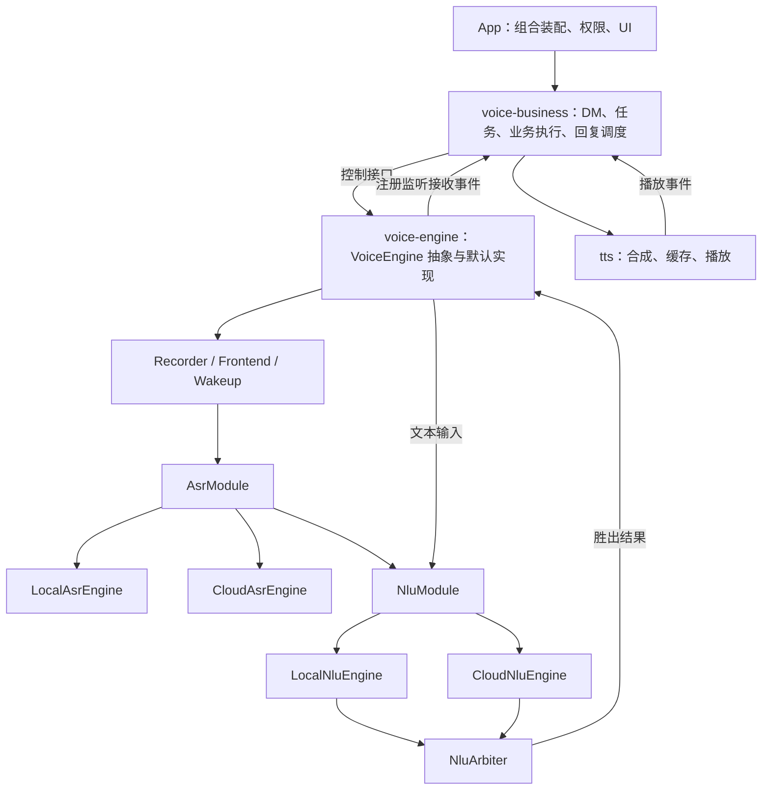
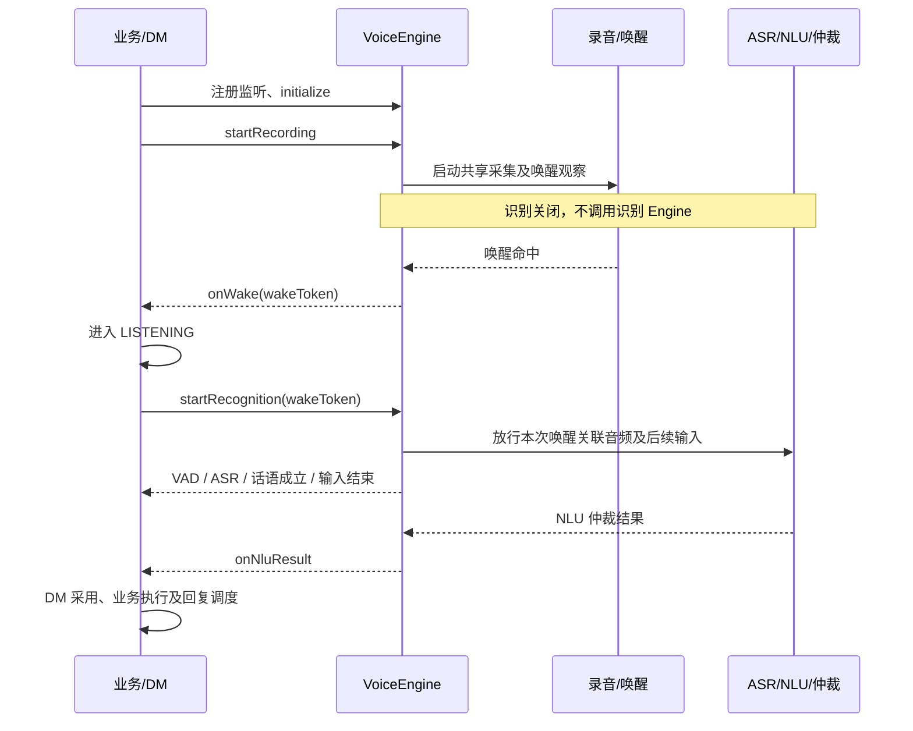
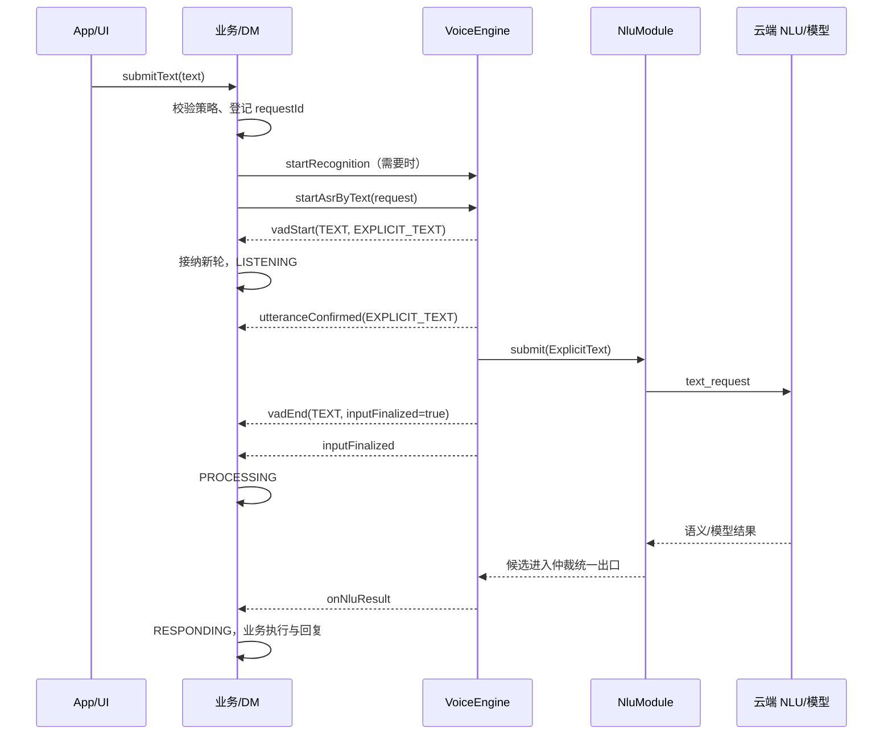

# TTS、语音引擎与语音业务三模块详细设计

日期：2026-09-29。状态：分期实施中。本文件描述目标方案；当前落地范围以第 17 节为准，不能把过渡装配当作最终模块边界。修订：NLU 不重复判断当前对话轮；下电通过重置 DM、停止录音/网络/播放完成，不新增逐请求或批量取消公共接口。

## 1. 设计结论与已确认需求

客户端按功能拆为 `tts`、`voice-engine`、`voice-business` 三个模块。语音引擎的边界止于 NLU 仲裁及结果交付；DM 和仲裁结果之后的业务处理全部属于语音业务模块。

本方案落实以下需求：

1. `VoiceEngine` 是统一抽象，提供初始化、释放、开启/关闭录音、开启/关闭识别、设置唤醒词、注册回调等能力。
2. 录音开关控制实际采集资源。整车下电关闭录音后，没有音频继续驱动 Frontend、唤醒和音频识别链路。
3. 识别开关是处理许可，不是“启动一次识别请求”。关闭后，即使有音频 feed 到模块入口，也不能调用内部识别 Engine。
4. `AsrModule` 统一封装 `LocalAsrEngine` 和 `CloudAsrEngine`，负责拦截、分发、生命周期和结果归一；`NluModule` 同样封装本地与云端 NLU Engine。
5. 初始化后识别默认关闭。语音唤醒后，由业务开启识别；退出对话后，由业务关闭识别。
6. 业务通过注册监听接收初始化状态、唤醒、VAD、流式 ASR、NLU 仲裁结果、错误等事件。
7. 文本入口名称为 `startAsrByText`。文本直接上传云端给 NLU/模型处理，不执行音频 ASR；前后必须发出 `vadStart`、`vadEnd`，使业务 DM 发生相应状态变化。
8. **VoiceEngine 不包含 DM，不持有业务处理器，不调用 TTS，不管理导航任务、对话续听和业务轮次。**
9. NLU 不复制 DM 的当前轮拦截。已受理且输入完整的请求可以继续处理并返回；关闭识别不自动使这类 NLU 结果失效。超时、连接关闭、释放和无法关联的回包按模块资源生命周期处理。
10. 下电采用粗粒度资源收口，不新增 cancelRequest/cancelAllRequests 公共接口，也不逐个发送取消协议。DM 默认未唤醒时不能由识别或播放回调重新激活。

文中的并发、错误码、队列限制、协议字段和迁移分期是为落实以上需求提出的工程约定。涉及阈值的参数在实施与真机验收时配置，不把建议值当作实测结论。

## 2. 当前实现与改造原因

当前工程已有多个 Gradle 技术模块，用户所说的“三模块”对应三个功能边界，不要求把所有基础设施强行合并成三个 Gradle 项目。

| 当前落点 | 现状 | 本次调整 |
| --- | --- | --- |
| `app/VoiceEngine.kt` | 同时持有候选协调、ConversationController、ResponseDispatcher、BusinessHandler、TtsOutput | 仅识别编排进入 DefaultVoiceEngine；DM、业务和输出编排迁出 |
| `app/RecordingCoordinator.kt` | 采集、唤醒、路由与对话快照、续听定时、闲聊策略混合 | 拆为引擎采集协调与业务聆听策略 |
| `voice-core/dialog` | 对话状态、候选准入、任务协调共处 | 对话与任务归业务；候选身份和识别事实归引擎 |
| `app/LocalSpeechEngines.kt`、`CloudSpeechEngines.kt` | 已有本地/云端 ASR 和 NLU 实现，但按端云链路装配 | 改为 AsrModule、NluModule 各自统一管理两个 Engine |
| `tts` | 已有统一 TtsOutput，但 AudioReply 等类型混有业务语义 | 保留输出模块，拆开播放数据和语义数据 |
| `GatewayProtocolSender`、服务端 `VoiceGatewayHandler` | 已有音频、TTS、取消、提交和闲聊入口；没有本方案要求的文本识别入口 | 新增文本请求和能力协商，复用语义处理及结果关联 |

当前代码依据见第 18 节。历史文档中的“VoiceEngine 管理会话并调业务/TTS”属于改造前边界；完成迁移后，应更新当前架构入口，不将新旧设计同时标为现状。

## 3. 总体架构与依赖方向



图中回调箭头是运行时事件方向，不代表引擎在编译期依赖业务模块。

### 3.1 建议的工程布局

```text
AutoVoice/
  voice-engine-api/          # 纯 Kotlin：接口、事件、识别结果、配置
  voice-engine/              # Android 实现与模块编排
    lifecycle/
    capture/
    wakeup/
    asr/
    nlu/
    arbitration/
    request/
    cloud/
  voice-business/            # DM、业务任务、路由、回复调度
    dialogue/
    listening/
    domain/
    response/
  tts/                      # 合成、缓存、播放及音频数据契约
  audio-frontend/            # 现有内部音频技术模块
  adapter-iflytek/           # 现有厂商 SDK 适配
  gateway-client/            # 通用连接与原始帧传输
  message-dispatch/          # 通用消息分发
  app/                      # 装配、平台适配、权限和 UI
```

`voice-engine-api` 是引擎功能的契约子模块，不是第四个业务功能模块。分离契约可以让业务单测使用 fake 引擎，不引入 Android 和厂商 SDK。

依赖约束：

- `voice-business → voice-engine-api + tts`。
- `voice-engine → voice-engine-api + audio-frontend + adapter-iflytek + 通信基础设施`。
- `tts` 不依赖 `voice-engine`、`voice-business` 或 DM。
- `app` 构造实现并注入业务，不再直接装配 ASR/NLU 回调和录音帧。
- `voice-core`、`business-core` 在迁移期保留兼容；最终按职责迁出，删除不再使用的壳模块。
- SDK 凭据、地址和调试策略由配置注入，引擎实现不得反向读取 `app.BuildConfig`。

### 3.2 通信和播放数据的归属

同一个 WebSocket 可以供识别、TTS、导航上下文和闲聊复用。由 App 组合根创建共享连接，通过独立通道/租约提供给各功能。关闭识别停止新的识别输入，不误关已有 NLU、业务或 TTS 正在使用的连接。

`GatewayBridge` 中的通用类型分发归基础设施；识别请求槽、ASR/NLU 监听归引擎；导航上下文和动作确认归业务；TTS 请求槽归 TTS 适配。禁止引擎继续通过桥持有导航业务对象。

播放数据类型放入 TTS 契约，例如 `PlaybackAudio`、`StreamingPlaybackAudio`，只包含格式、音频和播放身份。识别输出中的意图、动作身份、回复文本由业务保留并转换为播放数据。TTS 播放完成事件不得顺带携带或执行 Intent。

## 4. 资源开关和生命周期

### 4.1 三个独立状态维度

| 维度 | 状态 | 所有者 |
| --- | --- | --- |
| 引擎生命周期 | NEW、INITIALIZING、READY、DEGRADED、FAILED、RELEASING、RELEASED | VoiceEngine |
| 录音状态 | STOPPED、STARTING、RUNNING、STOPPING、FAILED | CaptureController |
| 识别许可 | DISABLED、ENABLED | RecognitionGate |

这里没有 LISTENING、PROCESSING、SPEAKING 等对话状态。引擎 READY 只表示资源/能力初始化完成，不表示用户已经唤醒。

初始约定：录音关闭、识别关闭。初始化不申请麦克风权限、不自动录音。App 完成授权与车辆状态判断后，由业务调用 `startRecording()` 进入待唤醒。

### 4.2 录音与识别组合

| 录音 | 识别许可 | 行为 |
| --- | --- | --- |
| 关闭 | 关闭 | 无采集；音频处理停止；新文本入口拒绝，已提交文本按请求生命周期收口 |
| 关闭 | 开启 | 无自动音频活动；允许显式文本请求 |
| 开启 | 关闭 | 可采集、做唤醒和必要前处理；ASR 拦截新输入，NLU 不接受新请求；已有完整输入可以处理完 |
| 开启 | 开启 | 唤醒/音频检测按配置运行；有效输入进入 ASR、NLU、仲裁 |

“没有录音整条链路不动”指没有采集继续驱动音频链路。文本是用户主动提交的独立输入，不需要麦克风。车辆下电策略同时关闭识别和录音，因此下电后文本入口也被关闭。

### 4.3 操作语义

| 操作 | 完成语义 |
| --- | --- |
| initialize | 初始化模块，返回每项能力可用性；同配置重复调用幂等，不重复建 SDK 实例 |
| startRecording | 开启唯一采集源；不改变识别许可，不自动发起 NLU |
| stopRecording | 关闭采集并释放 AudioRecord、音频效果及采集运行域；清输入缓存，不补交最后一段；已完成的本地计算即使晚回调也由 DM 判断是否采用 |
| startRecognition | 打开新输入准入许可和 ASR feed；不创建单次请求，不自动开麦 |
| stopRecognition | 禁止新输入，停止 ASR feed 并取消输入尚未收口的请求；已完成输入的 NLU 在原期限内自然结束；不关闭麦克风和唤醒 |
| startAsrByText | 在识别开启时提交一次文本，生成对应的 VAD 开始/结束和语义结果事件 |
| finishInput | 结束指定请求的输入，等待识别结果；用于按键松开等主动提交，与 stopRecognition 区分 |
| release | 关闭两种开关、释放模块和本实例通道租约，完成终态通知后注销监听；幂等 |

`stopRecording()` 不改变识别许可，也不处理纯文本云端资源。下电由业务关闭识别、录音和网络并重置 DM，见第 10.4 节。停止录音不得为了补齐音频尾帧而重新调用识别；只有正常 `finishInput()` 才冲刷 Frontend 尾帧并提交。

网络启停由组合层注入的连接生命周期组件管理，覆盖识别、TTS 和 realtime 的共享连接；不要求业务维护逐请求取消列表。模块内部仍可使用协程作用域取消、SDK stop/close、关闭 Channel 等实现资源释放，它们不是额外的业务取消协议。

释放后的实例不复用，由工厂新建实例。初始化失败可以清理后在同实例显式重试；不同配置的运行时重新初始化返回 `REINITIALIZATION_REQUIRED`。

### 4.4 低功耗约束

关闭录音后，应观察到麦克风释放、音频帧处理计数停止、唤醒 SDK 停止喂帧、不再生产新音频供上传。已排队网络数据由下电的网络关闭操作一并清理。Frontend 的处理任务停止或挂起等待，不能通过周期轮询空转。

模型权重可以按资源配置保留以缩短下次启动。停止输入后不再调度新推理；正在执行且不能中断的有限 SDK 调用可以自然返回，其结果由 DM 拒绝，不为此构造逐请求强制中断机制。若真机功耗证明必须立即停止某 SDK，由模块资源 stop/close 实现并验证。共享连接的心跳和重连在下电网络停用时停止。

现有服务端 `VoiceGatewayHandler.releaseConnection()` 已在连接拆除时撤销输出许可、关闭音频流和 realtime、清理轮次并停止连接工作线程。沿用该资源生命周期，不为下电先逐请求发送 `cancel_turn`。断开本地连接不保证远端供应商瞬间停止计算，远端任务依靠连接清理和既有超时结束；端侧停止活动与业务安全不依赖取消确认。

## 5. VoiceEngine 对外契约

以下 Kotlin 为接口设计草案，省略字段的类型在随后表格中定义；本文件不作为可直接编译的实现文件。

```kotlin
interface VoiceEngine {
    val snapshot: StateFlow<EngineSnapshot>

    fun registerCallback(callback: VoiceEngineCallback): Registration

    suspend fun initialize(config: VoiceEngineConfig): InitResult
    suspend fun release()

    suspend fun startRecording(): OperationResult
    suspend fun stopRecording(): OperationResult

    suspend fun startRecognition(
        options: RecognitionEnableOptions = RecognitionEnableOptions()
    ): OperationResult
    suspend fun stopRecognition(): OperationResult

    suspend fun startAsrByText(request: TextRequest): SubmitResult
    suspend fun finishInput(requestId: String): OperationResult

    suspend fun setWakeWord(config: WakeWordConfig): OperationResult
    suspend fun setWakeEnabled(enabled: Boolean): OperationResult
}

data class RecognitionEnableOptions(
    val wakeToken: String? = null
)

data class TextRequest(
    val requestId: String,
    val text: String,
    val context: RecognitionContext? = null
)

sealed interface SubmitResult {
    data class Accepted(val requestId: String) : SubmitResult
    data class Rejected(val code: EngineErrorCode) : SubmitResult
}

fun interface Registration {
    fun unregister()
}
```

### 5.1 参数与返回规则

- 控制方法挂起到该操作的本地状态切换完成，不等待最终 NLU 结果。
- `startAsrByText` 返回是否受理；识别成功或失败通过事件通知。业务在调用前就创建 requestId，不能依赖返回后才登记请求，否则快速回调可能无法关联。
- `RecognitionContext` 是一次请求的只读快照，包含版本、语言及业务提供的上下文扩展。引擎只透传和关联，不维护导航 taskId/revision 的有效性。
- 同一请求 ID 重复提交返回 `DUPLICATE_REQUEST`，不重新上传，不重新发 VAD。
- 权限失败返回 `MIC_PERMISSION_REQUIRED`；权限弹窗属于 App。
- 无可用识别路由时返回 `NO_RECOGNITION_ROUTE`；仅云端失败而本地可用时允许降级。
- 识别关闭时文本入口返回 `RECOGNITION_DISABLED`，不自行打开开关。
- 关闭录音和关闭识别重复调用幂等，不重复发送已结束请求的终态。
- `setWakeWord` 返回实际装载结果。动态更新时先暂停观察，结束旧 SDK 会话并重载，成功后恢复原监听许可；不调用 startRecognition。失败优先恢复旧配置，无法恢复时标记唤醒不可用并报错。
- 唤醒词数量、长度和字符支持由厂商能力报告限制，不承诺 SDK 未支持的任意词表。

`RecognitionEnableOptions.wakeToken` 只关联本次唤醒的预录缓存，默认不携带。它不表示 interactionId，不建立 DM。

### 5.2 初始化结果与错误

`InitResult` 返回生命周期状态和 `EngineCapabilities`，至少描述：录音、Frontend、VAD、唤醒、本地 ASR、本地 NLU、云端语音、云端文本是否支持/可用。

初始化就绪与远端当前在线分开表示。云端断线可以进入运行时降级，不要求整个引擎初始化失败；不能在真实 SDK 不可用时暗中切换 fake 命令。

错误包括：`NOT_INITIALIZED`、`RELEASED`、`MIC_PERMISSION_REQUIRED`、`RECOGNITION_DISABLED`、`INVALID_TEXT`、`TEXT_TOO_LONG`、`DUPLICATE_REQUEST`、`BUSY`、`UNSUPPORTED_CAPABILITY`、`CLOUD_UNAVAILABLE`、`TIMEOUT`、`QUEUE_OVERFLOW`、`SDK_FAILURE`。

错误事件应包含错误码、阶段、可恢复性、可选 requestId 和诊断信息。用户展示文案由业务决定，引擎不直接播报“网络异常”等话术。

## 6. ASR 模块设计

### 6.1 职责与组成

```text
AsrModule
  ├─ 统一 RecognitionGate / generation 校验
  ├─ 请求登记、音频格式检查、有界输入队列
  ├─ LocalAsrEngine
  ├─ CloudAsrEngine
  ├─ ASR 文本/话语成立事件归一
  └─ 取消、释放、输出有效性检查
```

本地、云端 Engine 不向业务开放，只能由模块调用。模块必须在“输入到达”和“实际执行前”都检查许可及请求代次，避免已排队音频在关闭识别后继续进入 SDK。

### 6.2 内部接口草案

```kotlin
internal interface AsrModule {
    suspend fun initialize(config: AsrConfig): ModuleInitResult
    fun begin(request: RecognitionRequest): ModuleResult
    fun feedAudio(requestId: String, frame: AudioFrame): FeedResult
    fun finishInput(requestId: String)
    fun cancel(requestId: String)
    suspend fun release()
}

internal interface AsrEngine {
    val capabilities: AsrCapabilities
    suspend fun initialize(config: AsrEngineConfig): ModuleInitResult
    fun begin(request: RecognitionRequest, sink: AsrSink)
    fun feedAudio(requestId: String, frame: AudioFrame)
    fun finishInput(requestId: String)
    fun cancel(requestId: String)
    suspend fun release()
}
```

模块和内部 Engine 共享同一请求身份。`AsrModule` 注入统一的只读 `RecognitionGate`；NLU 使用请求协调器已有的请求上下文，不另建一个随全局开关作废结果的 enable 开关。

### 6.3 本地和云端的实现差异

- 支持流式的 Engine 逐帧消费；只支持整段的 Engine 由模块有界聚合后调用。
- 云端 ASR 和 NLU 共享 `CloudSpeechSession`，音频只上传一次。ASR 负责订阅识别事件，NLU 负责关联语义候选，双方都不能自行重复发 `audio_start` 或 PCM。
- `CloudSpeechSession` 由引擎内部请求协调器管理，共享上行只有在 AsrModule 接受请求后才允许启动。
- 当前讯飞 2C 本地实现不提供独立 ASR。保留 LocalAsrEngine 槽位并报告此能力限制，不生成假 partial。被 AsrModule 接受的音频可通过内部输入凭据进入 LocalNluEngine 的直出语义适配，不能绕过总识别门禁。
- ASR 文本按自己的请求身份立即回调，不参与 NLU 仲裁。端云 partial 以来源区分，业务决定展示策略。
- “识别到了文字”和“有效话语成立”分开通知；业务不能靠文本长度或 partial 数量推断话语成立。

## 7. NLU 模块与仲裁设计

### 7.1 职责与组成

```text
NluModule
  ├─ 已有请求上下文校验（不判断当前业务轮）
  ├─ LocalNluEngine
  ├─ CloudNluEngine
  ├─ 输入适配：ASR 文本 / 本地命令音频 / 云端共享会话 / 显式文本
  └─ NLU 候选归一、资源释放与重复结果处理
         ↓
NluArbiter
  ├─ 候选入队规则
  ├─ 云端优先窗口和本地即时候选
  └─ 每请求最多一次胜出决定
```

NluArbiter 位于 VoiceEngine 内部，在 NluModule 后面。它不检查当前业务轮，不依赖 DM。

```kotlin
internal interface NluModule {
    suspend fun initialize(config: NluConfig): ModuleInitResult
    fun submit(input: NluInput): ModuleResult
    fun cancel(requestId: String)
    suspend fun release()
}

internal interface NluEngine {
    val capabilities: NluCapabilities
    suspend fun initialize(config: NluEngineConfig): ModuleInitResult
    fun understand(input: NluInput, sink: NluSink)
    fun cancel(requestId: String)
    suspend fun release()
}
```

### 7.2 输入和输出模型

`NluInput` 区分 `AsrTranscript`、`LocalCommandAudio`、`CloudSessionRef`、`ExplicitText`。每种输入携带 requestId、请求上下文和上下文快照。输入 generation 可用于追踪，但不与当前全局 generation 比较后决定 NLU 是否可以返回。本地直出和云端共享会话不要求等待一个不存在的 ASR final。

统一 `NluCandidate` 至少包含：requestId、route、候选类别、可选 Intent、识别文本、回复描述、动作身份/有效期、是否最终结果。具体厂商 payload 留在诊断扩展，不成为业务必需依赖。

NLU 输出区分结构化意图、模型回复和未知结果。模型自由文本不能直接当作可执行 Intent；动作由业务验证和执行。

### 7.3 输入拦截和结果拦截分别设计

NLU 不直接读取“当前对话轮”，也不在每个输入和回调处重复检查全局 recognitionEnabled。它复用已有请求上下文：实例身份、requestId、路由、输入是否完成、原始 deadline 和处理结果。无需额外设计一套取消票据、跨模块取消账本或取消确认状态机。

请求协调器在新音频/文本进入时检查识别许可。NLU 内部任务只凭有效请求继续运行，关闭许可不自动撤销已完成输入的请求上下文。这避免“业务暂时关掉接收输入，却意外丢掉正在等待的回答”。

| 情况 | NLU 行为 | 判断归属 |
| --- | --- | --- |
| 识别关闭后新提交文本或音频 | 入口拒绝，不创建 NLU 请求 | VoiceEngine / AsrModule 的输入准入 |
| 已登记请求的输入在关闭前收口，ASR final 或待处理语义稍后到达 | 允许凭原请求继续 NLU，不因当前开关或 generation 不同拒绝 | 请求协调器与 NLU 请求上下文 |
| 关闭时输入仍未收口 | 取消该输入请求，不补交残缺音频；关联 NLU 一并取消 | 请求协调器 |
| 已启动的 NLU 在关闭识别后返回 | 正常进入仲裁和回调，不把“晚到”当错误 | 仲裁负责胜出，DM 负责采用 |
| 新业务轮建立，旧 NLU 返回 | 引擎可回调；DM 拦截非当前轮，不执行、不播报 | DM |
| 对话已经退出，NLU 返回 | 引擎可回调；DM 按 interaction/turn 有效性丢弃 | DM |
| 连接已关闭、超时、release 后回包 | 按已结束的通道/请求清理资源，不复活模块 | 模块资源生命周期 |
| 无法关联、错误实例、重复最终结果 | 拒绝或去重并记录诊断 | 协议关联与输出账本 |

输入已经收口但晚到的 ASR final 属于既有请求完成信息，不能通过当前 ASR feed 开关把它一起丢弃。模块停止音频 feed 与保留必要的结果监听要分开实现。

不因业务换轮主动逐个取消旧 NLU。业务只更新当前交互和轮次，旧结果即使返回也不能执行或播放。下电时关闭整条连接和采集运行域；任务与队列由各自资源所有者统一收口，业务不追踪每个底层 Engine 是否已取消。

### 7.4 仲裁规则与关闭行为

第一阶段保持现有规则：本地即时命令先具备入队资格；普通本地语义等待云端优先窗口；云端不可用时允许有效本地语义立即入队；就绪队列按到达顺序处理。规则配置由装配提供，引擎不执行车窗、导航等动作。

显式文本只进入云端 NLU/模型，不启动本地音频链，不等待不存在的本地候选。仍通过统一输出账本交付结果，防止重复回包导致重复业务动作。

普通仲裁胜出沿用当前行为，不强制取消输家。`stopRecognition` 仅停止新输入并收口未完成输入，保留已完成输入的语义处理。连接关闭、超时和释放由资源所有者结束对应任务、等待槽和数据流。

因此，NLU 结果“对话已过期”和“所属连接/模块已经关闭”是两种情况：前者交由 DM 丢弃，后者属于引擎资源生命周期。每个请求仍在原有处理期限内结束，关闭识别不延长期限、不允许后台任务无限保留。

### 7.5 模型文本与音频流

保持现有低延迟流式能力时，拆分“选择输出来源”和“最终语义完成”：

1. `onOutputSelected` 最多一次，确定该 requestId 使用哪个 responseId/route；选定后不再切换来源。
2. 模型文本/音频在该来源胜出后才允许交付；未胜出的片段仅在有界缓存中等待或被丢弃。
3. `onNluResult` 是最终语义事件，最多一次。流开头不能把尚未完整的动作当作最终语义执行。
4. 流式音频通过单消费句柄交给业务，再由业务交给 TTS。多播 callback 不能让多个监听器争抢同一 ReceiveChannel。
5. 取消后关闭流句柄并丢弃后续片段。流结束失败可以终止请求；流已经播放的部分无法回滚，业务决定是否提示失败。
6. 非流式结果可在同一处理步骤先选定输出再交付最终语义。
7. 已完成输入的模型流可在 stopRecognition 后继续交付。业务在每个文本/音频输出的消费入口检查当前交互和 responseId；不能只检查最终 NLU 而让旧流先播放。拒绝流时调用取消/关闭句柄释放资源，不单纯遗弃流导致队列阻塞。

普通文字回复不必增加音频合成步骤到 VoiceEngine；业务根据最终回复自行调用 TTS。

## 8. 事件契约、身份与顺序

### 8.1 Callback

```kotlin
interface VoiceEngineCallback {
    fun onInitializationChanged(event: InitializationEvent) {}
    fun onRecordingChanged(event: RecordingEvent) {}
    fun onRecognitionEnabledChanged(event: RecognitionEnabledEvent) {}
    fun onWake(event: WakeEvent) {}

    fun onVadStart(event: VadStartEvent) {}
    fun onVadEnd(event: VadEndEvent) {}
    fun onInputFinalized(event: InputFinalizedEvent) {}
    fun onUtteranceConfirmed(event: UtteranceConfirmedEvent) {}
    fun onAsrResult(event: AsrResultEvent) {}
    fun onPending(event: RecognitionPendingEvent) {}
    fun onOutputSelected(event: OutputSelectedEvent) {}
    fun onModelOutput(event: ModelOutputEvent) {}
    fun onNluResult(event: NluResultEvent) {}
    fun onRecognitionCompleted(event: RecognitionCompletedEvent) {}
    fun onError(event: VoiceEngineError) {}
}
```

注册立即获得当前引擎状态快照，不回放历史识别结果。业务服务是负责动作的主监听方；UI、日志监听可以观察，但不重复执行动作。`unregister()` 幂等，阻止尚未开始派发的后续回调；已经开始执行的回调不能强行撤回。

### 8.2 身份字段

| 字段 | 所有者和用途 |
| --- | --- |
| engineInstanceId | 标识引擎实例，过滤重建前的迟到结果 |
| recognitionGeneration | 标识音频 feed 和新输入准入有效期；不作为已受理 NLU 输出的全局过滤条件 |
| requestId | 一次输入及其 ASR/NLU/模型输出关联；引擎拥有 |
| segmentId | 同一请求内的音频段及网关槽关联 |
| sequence | 单请求事件递增序号 |
| source | MICROPHONE、AUDIO、TEXT；AUDIO 为后续已有录音扩展预留 |
| interactionId / turnId | DM 的连续交互与已接纳业务轮；业务拥有 |
| taskId / revision | 业务任务身份；引擎仅可透传快照 |
| playbackId | TTS 播放身份 |

迁移期可将已有 utteranceId/captureId 值作为 requestId，并将 wire utteranceId 映射到 requestId。它们值相同不表示引擎拥有业务 turn。旧回包缺少足够身份时，无法可靠关联的结果直接丢弃，不猜测归属到“最新请求”。

### 8.3 VAD 与输入收口

`VadStartEvent` 包含事件头、segmentId、source、`synthetic` 和有效输入证据。`VadEndEvent` 另外包含 `reason` 及 `inputFinalized`。

结束原因至少包括 `NORMAL`、`CANCELLED`、`FAILED`、`RECORDING_STOPPED`。不论真实音频还是文本，对外已发出的 start 都必须有对应 end；取消可生成带原因的收口事件，不伪装成正常声学端点。

一次输入可能包含多个声学 VAD 段，因此普通 `vadEnd` 不一定代表整个请求输入完成。`inputFinalized=true` 才映射为请求级 `onInputFinalized`。专用事件保留现有输入收口语义，两种通知按相同身份幂等处理。

文本只有一个合成段，`synthetic=true`、`source=TEXT`，正常 `vadEnd.inputFinalized=true`。不伪造 ASR 文本或声学置信度。

### 8.4 文本事件顺序

成功路径：

```text
受理请求并登记身份
→ vadStart(TEXT, synthetic=true, evidence=EXPLICIT_TEXT)
→ utteranceConfirmed(EXPLICIT_TEXT)
→ 文本交给本地云端发送队列
→ vadEnd(TEXT, NORMAL, inputFinalized=true)
→ inputFinalized
→ pending / outputSelected / 模型流事件（按实际响应）
→ nluResult
→ recognitionCompleted(SUCCESS)
```

`vadEnd` 表示文本输入交付完毕，不等待云端回答、ASR final 或模型生成完毕。只有成功进入有界发送队列才算正常提交；连接和服务器是否接受通过后续结果或错误反映。

本地提交失败时，已发 start 的请求走 `vadEnd(FAILED)`、错误、`recognitionCompleted(FAILED)`，不进入正常等待。云端提交后异步失败则保留已经正常结束的 VAD，只追加错误与失败终态。

快速云端回包先排队，必须在该文本请求的正常 end/inputFinalized 之后交付。识别关闭若先于文本输入提交完成，收口未完成输入；若输入已提交完成，则保留该请求的 NLU。连接关闭、超时或模块释放按正常失败/结束事件收口。

### 8.5 一般顺序与派发保证

- 同一 requestId 的事件由串行派发器排序；跨请求不承诺整体先后，消费者必须核验身份。
- 音频 ASR partial、话语成立、甚至可提前完成的语义可能在音频输入结束前到达，不能套用文本的全部顺序约束。
- 每个已受理请求最多一个识别终态：SUCCESS、NO_RESULT、CANCELLED 或 FAILED。
- 关闭识别后不再接收旧 generation 的音频 feed；已完成输入的请求仍可交付 ASR 完成信息、NLU 和模型流。连接/模块已关闭时不恢复旧流或等待槽；已排队到业务的回调由 DM 最终拒绝。
- 不在 AudioRecord、SDK 或传输收包线程运行业务代码，不在内部锁里回调监听器。
- 回调只负责向业务串行事件队列投递，不执行阻塞动作。单个监听器异常不影响其他监听器。
- partial 可按同请求、同来源合并为最新快照；VAD、最终结果和终态不能静默丢弃。监听队列溢出要明确标记交付失败、停止相关请求并暴露可查询故障状态。

## 9. VoiceBusinessService 与 DM

### 9.1 业务模块组成

```text
VoiceBusinessService（唯一交互入口与引擎主监听者）
  ├─ ConversationController + DialogueStateMachine
  ├─ DialogueListeningController
  ├─ AppDialogueManager / TaskDialogueCoordinator
  ├─ BusinessRouter / BusinessHandler
  ├─ ActionExecutionGateway / 导航及车控执行器
  └─ ResponseDispatcher → TtsOutput
```

延时聆听、处理超时、交互绝对期限、任务 revision、是否打断、是否进入闲聊都在业务。引擎只实现明确的采集、检测、输入和取消指令。

现有录音协调器中依赖 `DialogueSnapshot`、`isPlaybackSpeaking` 和任务聆听指令的分支迁出。若音频实现需要播放活动信息进行回声处理，只接收业务注入的通用音频输出活动信号，不反向引用 TTS 或 SPEAKING 状态。

### 9.2 DM 状态保持五阶段

沿用 `DORMANT / LISTENING / PROCESSING / RESPONDING / SPEAKING`。本次改造改变状态机所在模块及事件来源，不额外设计第二套对话状态。

| 事件 | 业务动作 |
| --- | --- |
| onWake | 校验电源/业务策略，建立或更新 interaction，进入 LISTENING，开启识别 |
| 音频 vadStart | 建立候选输入记录；不单凭声学 VAD 抢占旧业务轮或停止播报 |
| utteranceConfirmed | 校验所属交互后接纳新轮，按打断策略处理旧输出 |
| 文本 vadStart(EXPLICIT_TEXT) | 将显式文本作为已确认用户输入接纳，进入 LISTENING；无需等待实际 ASR |
| 正常输入最终结束 | 已准入请求进入 PROCESSING；尚未准入的音频候选只记录结束事实 |
| pending | 更新当前请求处理进度，不使已响应/播报的状态倒退 |
| 最终 NLU | 校验当前业务轮与任务，进入 RESPONDING、执行或生成回复 |
| TTS 真正开始播放 | 进入 SPEAKING |
| 播放结束/无输出/播放失败 | 根据任务和业务策略续听或退出 |
| 退出对话 | 先撤销业务采用资格，再关闭识别，清理任务与输出，回到 DORMANT |

文本的 vadStart 已足以驱动新轮准入，随后 `utteranceConfirmed(EXPLICIT_TEXT)` 是同一证据的统一通知，DM 幂等处理，不能创建两个 turn。

这保留“噪声不抢占旧轮”的现有约束，同时满足文本必须通过 VAD 事件推进对话的要求。不能为了文本入口把所有真实 VAD 都改为强制新轮。

#### 未唤醒状态的硬约束

`DORMANT` 是业务结果采用的关闭状态。只有当前资源生命周期内的新唤醒、合法按键入口或业务已登记的显式文本输入，才能经过统一 `beginInteraction` 入口进入 LISTENING。此入口还需检查电源和业务许可；`source=TEXT` 字段本身不是授权，不能把迟到的文本 VAD 当作新用户输入。

| 当前状态 | 事件 | 目标行为 |
| --- | --- | --- |
| DORMANT | 合法新唤醒/显式交互入口 | LISTENING，建立新 interactionId |
| DORMANT | 普通 VAD、旧文本 VAD、ASR 话语成立、NLU、pending | 保持 DORMANT，不建立 turn、不产生业务动作 |
| DORMANT | 播放开始、播放结束、旧 timer | 保持 DORMANT，不创建续听窗口 |
| LISTENING / PROCESSING | 当前轮最终 NLU | RESPONDING；其他轮只丢弃 |
| RESPONDING | 当前轮且当前播放身份的开始事件 | SPEAKING |
| 任意状态 | 下电/reset | DORMANT，清交互及轮次身份 |

读取当前实现可以确认：`onFinalSemantic` 只允许 LISTENING/PROCESSING 转 RESPONDING，`onPlaybackStarted` 只允许 RESPONDING 转 SPEAKING，两者都校验 turnId。所以当前代码已经禁止 DORMANT 直接进入响应或播报。

但 `DialogueStateMachine.onSpeechCommitted()` 目前没有 DORMANT 守卫，并会在 interactionId 为空时创建交互。正常路径依赖 ConversationController 的候选准入与 reset 清理；拆分后不能让晚到的识别证据通过这个低层方法间接唤起对话。目标改动是让它只在已有活动 interaction 时接纳话语，不再隐式新建 interaction；所有新交互统一从显式入口建立。

业务执行和 TTS 调度必须使用状态机的“已采用”结果，拒绝转换就不派发副作用。对于已异步排队的动作/音频，在实际执行前再检查当前 interaction/turn；reset 及执行准入在同一业务串行域中排序。这样不需要靠每条 NLU 的远端取消来保证下电后不响应。

### 9.3 识别开启策略由业务统一计算

```text
允许识别 = 车辆/应用允许交互
        且对话处于活动期
        且没有业务输入抑制原因
```

业务输入抑制采用原因集合或租约，例如电话占用、专注播放、模式切换；只有最后一个抑制原因解除且对话仍有效时才重新开启，避免多个业务互相覆盖开关。

唤醒事件不绕过业务抑制。退出对话清理恢复请求，迟到的业务“恢复识别”不能重新打开已退出的对话。

### 9.4 业务提交文本入口

App/UI 调用 `VoiceBusinessService.submitText(text)`，不直接绕过业务调用引擎。该方法先检查文本和业务策略，登记 requestId 与交互意图，确保识别开启，再调用 `startAsrByText`。

首次文本输入是显式交互入口，不需要声学唤醒。它的 DM 转换由随后收到的文本 VAD 事件触发。若尚未发 VAD 就拒绝受理，业务回滚临时开启许可，不留下“没有对话却一直开着识别”的状态。

业务允许的文本输入通过门禁，不能自行覆盖电话等抑制条件。用户选择替换当前输入时，业务更新当前轮次；引擎按既有有界槽接纳或返回 BUSY，不要求业务逐个取消底层请求。旧语义即使完成也不能重新获得业务采用资格。

## 10. 关键场景时序

### 10.1 启动、唤醒与语音输入



唤醒等待业务开启识别期间，保留短时、有界、带 wakeToken 的预录缓存。该缓存只用于这次唤醒衔接，过期、拒绝、关闭录音或释放立即清理；一般业务恢复识别不回放此前关闭期间的历史音频。

### 10.2 文本输入



图中的 `text_request` 表示本地提交发送操作，不以远端完成为 vadEnd 前置条件。文本不进入 Frontend、唤醒或 ASR，也不打开麦克风。

### 10.3 退出对话

1. DM 将当前交互标记为不可再采用结果，撤销续听/处理定时器及任务等待。
2. 业务调用 `stopRecognition()`，引擎关闭新输入并推进输入 generation，收口未完成输入；已提交 NLU 可自然结束，无需遍历请求取消。
3. 业务按退出策略停止 TTS；引擎不调用 TTS。
4. DM 回到 DORMANT；录音和唤醒继续，等待下一次唤醒。
5. 旧 ASR、NLU、音频流、播放完成和任务回调由业务核验各自身份，不能重启已退出的对话。NLU 回调本身可以发生，不等于允许执行或播放。

### 10.4 整车下电

```text
业务串行接收下电事件，先禁止唤醒、文本和按键建立新交互
→ DM.reset()：DORMANT，清 interaction/turn、候选、任务、定时器
→ stopRecognition()：恢复默认关闭许可，阻止新输入
→ TtsOutput.stop()：停止已经开始的播报并清播放队列
→ stopRecording()：停麦克风、Frontend/唤醒喂帧，清输入缓存
→ networkController.stop()：关闭连接及网络运行域，清等待槽/上传队列
→ 需要释放模型内存时再 release()，不是每次下电的必需步骤
```

本方案不提供用于下电的 cancelAllRequests，也不要求业务遍历 requestId 向 Local/Cloud ASR、NLU、仲裁和服务端发送取消。网络关闭、采集关闭和播放停止各自完成所属资源清理，具体使用协程 cancel 或 SDK close 属于模块内部实现。

#### 网络停止的实际含义

`networkController.stop()` 是建议的连接所有者生命周期语义，不声称现有 disconnect 已完整实现：

1. 先将网络运行许可设为停止，禁止 ensureReady、warmUp、后台重连及 TTS 请求重新建连。
2. 停止连接/重试任务和该连接的数据收发运行域，关闭 WebSocket；若关闭握手超时则使用传输层断开能力，不等待逐请求确认。
3. 在连接所属域统一清空待上传数据、结束 pending Deferred/Channel、释放回复槽和流资源；不增加跨模块取消账本。
4. 将既有等待者以连接关闭收口。它们即使产生回调也因 DM 已经 DORMANT 而不能响应或播报。
5. 共享连接由组合层统一停用，覆盖语音、TTS 和 realtime；若存在独立 HTTP/TTS 通道，其资源所有者同样关闭对应运行域。

当前 `GatewayClient.disconnect()` 主要关闭当前 socket；`GatewayCloudRunner.ensureReady()` 仍可能发起 connect，部分 pending 资源位于 Bridge。因此实施时要补齐网络所有者的整体 stop 语义，不能只调用裸 disconnect 就宣称下电资源完全结束。现有 `GatewayCloudRunner.close()` 和服务端连接拆除流程可复用。

#### 状态正确性与资源释放分别保证

- **状态正确性**：DM 默认未唤醒，任何旧 ASR/NLU/播放回调都不能恢复对话；新的当前轮身份也不能与旧结果混淆。
- **资源释放**：采集停止、网络停止、播放停止各自释放资源。DM.reset 不能自动关掉播放器或正在重连的网络，所以这几项仍需调用。
- **本地不可中断调用**：已有有限推理可自然完成；停止输入后不再启动新任务，晚到结果仍过不了 DM。仅在实际功耗要求时增加 SDK 级停机，不预先构造逐请求取消系统。
- **副作用**：已执行的车辆动作不能因 reset 回滚；reset 生效后，排队尚未执行的动作和播报在业务执行边界再次检查当前轮，不能只在收到 NLU 时检查一次。

上电后显式恢复网络许可和采集，DM 仍为 DORMANT、识别仍关闭，等待新的唤醒或合法文本入口。旧请求不重放、旧任务不恢复、旧 wakeToken 不复用。前一次采集/连接运行域的迟到回调不能触发新的唤醒入口。

### 10.5 业务临时禁止识别

增加抑制原因 → stopRecognition → 保留录音/唤醒 → 解除原因 → 业务判断对话是否仍活动 → 符合条件才 startRecognition。关闭期间采集的新音频不缓存待识别；关闭前已经收口的输入继续 NLU。若当前轮仍有效，DM 可以采用其结果，是否播放由业务策略决定。

### 10.6 现有 realtime 闲聊

进入/退出闲聊由业务 DM 决定；音频传输及模型适配留在引擎的云端路由，结果播放归业务/TTS。普通请求与 realtime 的 responseId、generation 保持分离，不将 `chat:` 身份混入普通 turn。

关闭识别必须覆盖 realtime 的新音频上行，不能保留旧 `appendRealtimeAudio` 直通路径绕过 AsrModule/RecognitionGate；已提交完整输入对应的输出由请求生命周期和 DM 控制。下电关闭录音、连接和播放，realtime 会话由连接所有者统一关闭。若供应商不能分离停输与停会话，适配器报告能力限制，由业务选择结束模式，不能假装拥有独立开关。完整 realtime 功能迁移单独验收。

## 11. 并发、门禁和请求生命周期

### 11.1 统一门禁

RecognitionGate 是新输入准入的单一事实源，保存 `enabled`、输入 generation 和实例身份。ASR feed、新文本入口、共享音频上传检查它；NLU、仲裁和结果派发检查独立请求生命周期，不比较当前业务轮，也不因输入 generation 变化作废已收口请求。

识别关闭步骤：

1. 在控制队列上原子关闭许可并推进 generation，这是操作生效点。
2. 停止旧 generation 的音频 feed，释放尚未送识别的排队帧和普通预录缓存。
3. 根据输入收口事实分类：未收口请求取消；已经收口的请求保留请求上下文、NLU 队列、仲裁候选及必要的 ASR 完成监听。
4. 对取消组调用内部 Engine/远端取消，补齐 VAD 结束和取消终态；不自动取消保留组。
5. 保留组继续处理到原 deadline，内容事件交业务判断是否仍属于当前轮。
6. 发布识别关闭状态并返回，不等待保留组完成。下电复用采集和网络生命周期清理，release 负责最终释放，不新增批量取消流程。

已经交给业务的事件无法撤回，所以业务退出必须先撤销采用资格。三类校验分别是：输入许可、所属资源是否仍有效、业务是否仍采用；其中只有最后一类判断“当前对话轮”。引擎不得用全局最新 requestId 或 generation 重复实现 DM。

### 11.2 请求状态

```text
CREATED → INPUT_OPEN → INPUT_FINALIZED → RESOLVING → COMPLETED
                └──────────── 任意活动阶段 → CANCELLED / FAILED
```

实现可将输入状态和输出状态分开保存，因为流式 ASR/NLU 可以在输入结束前返回。上图是普通完整路径，不限制流式交错。提前胜出时由请求协调器关闭本请求输入并发对应收口，不关闭全局识别。

请求生命周期与 DM 的 LISTENING/PROCESSING 完全不同，命名和 API 都不能混用。

### 11.3 并发上限与新轮替换

沿用现有“一个已确认处理中请求 + 一个待确认音频候选”的有界模型，保留播报期有效话语准入能力。声学 VAD 只创建候选，不能自动让上一请求失效；有效话语确认后才按既有协议提交新输入。

端侧发送 `turn_commit` 表示技术上确认有效输入，与 DM 的业务采用分开。服务端目前也可由 ASR 自行确认，因此业务抑制必须在开启识别前生效，不能依赖收到云端结果后再阻止已经上传的输入。

文本是显式输入，但是否替换当前业务由业务决定。无空槽时返回 BUSY；不积压多个待执行文本，不自动重放，也不为绕过 BUSY 新增业务逐请求取消机制。未来多音区并行需要按音区扩展身份与限额，本次不隐式支持。

### 11.4 队列和线程

- 控制命令使用串行协调器，音频采集、推理、网络和业务事件各有独立执行上下文。
- PCM、云端发送、候选及输出流都设上限；超限明确失败对应请求，不静默丢中间音频。
- 配置至少包含预录时长、单次最大输入时长、PCM 缓存字节数、事件队列容量、云端输入/结果超时。
- 不持有内部锁执行外部回调或调用业务控制方法；业务回调通过队列异步提交控制请求，避免重入死锁。
- 正常结束音频时保持现有 Frontend 跨块尾帧处理，保证输入输出样本数；取消和下电只清理，不送补帧识别。

## 12. 文本上行协议与服务端改造

### 12.1 新增协议

建议增加可协商能力 `text_recognition_v1` 和消息 `text_request`。以下是目标协议示例，尚未写入现有正式协议：

```json
{
  "type": "text_request",
  "payload": {
    "sessionId": "session-1",
    "requestId": "req-1",
    "utteranceId": "req-1",
    "segmentId": "text-seg-1",
    "text": "导航到公司",
    "language": "zh-CN",
    "inputSource": "text",
    "contextVersion": 1,
    "context": {}
  }
}
```

`utteranceId` 和 `segmentId` 用于兼容现有追踪、回复槽、取消接口；目标 requestId 是统一输入身份。服务端回显身份，文本请求不要求 audio_start/audio_end 或二进制帧。

文本 vadStart/vadEnd 是端侧合成的输入生命周期事件，不发送成服务器声学事件。

### 12.2 服务端职责

1. `VoiceGatewayHandler` 增加文本分发，具体校验与处理放独立 `GatewayTextEndpoint`，不继续堆积在主 handler。
2. 校验文本非空、长度、身份、上下文版本、连接配额和并发槽；重复 requestId 不重复执行。
3. 显式文本是有效输入证据，不调用 ASR；确认新输入后执行与既有轮次一致的输出资格管理。
4. 从现有音频链中提取可复用的语义/模型处理入口，例如 `TextUnderstandingPipeline`。不能将文本编码成音频，也不能直接调用只支持 PCM 的 OnlineSpeechProvider。
5. 按已有语义策略调用可接受文本的 NLU 和模型；音频专用离线候选不被伪造参与。
6. 下行复用可关联的 pending、decision、reply、模型流和 error；文本不生成 asr_partial。
7. 文本任务绑定连接生命周期，断开时与音频任务一起收口。已有 `cancel_turn(segmentId)` 若需兼容可覆盖文本，但下电流程不依赖逐请求发送该消息。
8. 动作身份、任务上下文、期限和执行校验继续沿用业务协议，不把服务端已经执行的工具操作视为可由客户端断网回滚。

### 12.3 兼容与失败处理

- 客户端先确认服务端能力；没有 `text_recognition_v1` 时报告 `UNSUPPORTED_CAPABILITY`，不静默尝试 TTS 接口或空音频绕行。
- 可在受理前发现的不支持/无网络错误直接拒绝，不发 VAD；受理后连接变化走正常错误收口。
- 断线结束当前请求，不自动重放文本或 PCM，防止重复执行潜在业务动作。
- 先部署支持新能力的服务端，再启用客户端文本功能；已有音频和 TTS 协议继续兼容。
- 所有新字段、错误码、消息及 fixture 在实施时同步更新 `shared/protocol.md` 与契约测试。

## 13. 迁移映射

| 现有类/目录 | 目标位置 | 迁移说明 |
| --- | --- | --- |
| VoiceEngine | voice-engine/DefaultVoiceEngine + voice-business/VoiceBusinessService | 按职责拆分，不能整类搬迁 |
| VoiceEngineFactory | 引擎工厂 + App 组合根 | 引擎工厂不再构造 BusinessHandler、DM、TTS |
| RecordingCoordinator | engine/CaptureController + business/ListeningPolicy | 采集、路由和前处理留引擎；超时、续听和播放打断归业务 |
| AudioRecorder / AudioFrontendEngine | 引擎内部及 audio-frontend | 唯一麦克风所有者不变 |
| WakeWordPort / IflytekWakeWordObserver | engine/wakeup + adapter-iflytek | 增加实际可生效的动态词更新和能力状态 |
| LocalSpeechChain / LocalSpeechEngines / CloudSpeechEngines | AsrModule、NluModule 及其内部 Engine | 从端云链路聚合转为能力模块聚合 |
| CandidateCoordinator | engine/request/RecognitionCoordinator | 保留请求、候选和数据资源事实，不接入 DM |
| TurnAdmissionGate | 引擎 RecognitionEvidenceTracker + 业务准入检查 | 引擎记录话语成立；业务决定是否采用为当前 turn |
| ConversationController / DialogueStateMachine | voice-business/dialogue | 移除对采集和引擎内部可变对象的直接访问 |
| DialogueListeningController / TaskDialogueCoordinator | voice-business | 处理交互期限、续听及任务 revision |
| AppDialogueManager / NavigationSession / BusinessHandler | voice-business | 领域适配器可由 App 注入 |
| ResponseDispatcher / ActionExecutionGateway | voice-business/response、domain | NLU 结果之后的执行和播报调度 |
| OnDeviceRaceArbiter / SemanticEmissionLedger | voice-engine/arbitration | 保持单次胜出及现有窗口规则 |
| GatewayBusinessSpeechChannel / StreamingCloudRunner | voice-engine/cloud | 共享 ASR/NLU 上传，所有入口纳入门禁 |
| GatewayNavigationContextChannel | 业务通信适配 | 不让引擎持有导航状态 |
| GatewayRealtimeChatChannel | 引擎云端路由 + 业务模式控制 | 传输和模式策略分开迁移 |
| TtsOutput / TtsService | tts | 保留统一入口，去掉识别语义类型依赖 |
| MainViewModel | app | 调业务服务、展示状态，不再拼接采集/识别回调 |

Telemetry 按事件产生方归属，不作为跨模块反向依赖理由。统一追踪接口可以注入各模块；所有事件携带自己的请求快照，不读取全局“当前轮”猜测归属。

## 14. 实施分期与完成条件

### P1：契约和业务边界

新增 voice-engine-api、voice-business；定义事件、状态、门禁与文本契约。将 DM、ResponseDispatcher、业务执行与 TTS 调度迁出旧 VoiceEngine，并用兼容适配器连接现有识别链。

完成条件：业务能用 fake VoiceEngine 独立运行；引擎代码不再依赖 DM、BusinessHandler、TtsOutput；现有业务与播放回归通过。

### P2：统一 ASR/NLU 模块和开关

实现 DefaultVoiceEngine、RecognitionGate、AsrModule、NluModule 和事件派发；纳入端云共享上传、取消、请求身份和仲裁。迁移 Recorder、Frontend、Wakeup，将续听策略移入业务。

完成条件：关闭识别后新的 feed 不会调用内部 Engine，已有完整输入的 NLU 可以正常完成；DM 拦截过期业务结果，资源关闭后不被迟到任务重启；关闭录音后音频链路停止；唤醒和退出的识别开关完整成立。

### P3：文本输入闭环

实现 startAsrByText、合成 VAD、显式文本准入、云端文本 endpoint、能力协商和协议契约。业务提交文本路径包含临时开启失败回滚。

完成条件：文本不触发录音或 ASR，DM 按 VAD 输入事件转换，快速成功、拒绝、取消、超时、断线都能正确收口。

### P4：流式兼容、App 接线和清理

迁移模型流、realtime、导航上下文和播放数据；替换 MainViewModel 接线；删除旧直通入口和不再需要的兼容壳；更新当前架构与开发文档。

完成条件：端云仲裁、导航多轮、语音退出、续听、TTS、realtime、下电恢复均通过对应回归；静态依赖无环，业务不能绕过模块访问内部 Engine。

每期保持可构建和可回归，不在同一阶段同时替换厂商算法、修改仲裁优先级和改变 DM 状态枚举。

## 15. 验证与验收矩阵

以下为实施阶段需要完成的验证计划，本次文档工作未执行这些测试。

| 类别 | 场景 | 必须验证的结果 |
| --- | --- | --- |
| 初始化 | 重复初始化、部分能力失败、释放期间调用 | 无重复 SDK 会话，状态和错误明确 |
| 初始许可 | 初始化并开启录音，但未唤醒 | 本地/云端 ASR、NLU 调用计数为零；唤醒可用 |
| 唤醒 | 命中唤醒并被业务允许 | 开启识别，预录只消费一次，不丢话首 |
| 业务抑制 | 抑制期间唤醒；多个抑制原因交错解除 | 不越权开启识别，退出后不被迟到恢复重开 |
| ASR 门禁 | 关闭时 feed；入队后关闭再执行 | LocalAsrEngine、CloudAsrEngine 不被调用 |
| NLU 新请求准入 | 关闭时新提交文本/音频；无有效凭据的本地直出 | 不建立新的 LocalNluEngine、CloudNluEngine 请求 |
| NLU 已有请求 | 输入先收口，再关闭识别；随后 ASR final/语义输入到达 | 允许继续 NLU，不能仅凭开关或输入 generation 拒绝 |
| NLU 迟到结果 | DM 换轮/退出后，未取消的旧 NLU 返回 | 引擎可正常回调，DM 不执行、不播报、不倒退状态 |
| 临时关闭输入 | 当前轮有效，业务关识别后收到该轮 NLU | DM 可以继续采用，不能误丢正在等待的回答 |
| 资源关闭 | 网络/模块关闭后的迟到回包 | 无重建连接、无恢复旧流；DM 不采用已交付的旧事件 |
| 录音关闭 | 活动音频输入中 stopRecording | 不补帧提交，麦克风释放，不再生产新音频 |
| 输入完成 | finishInput 与 stopRecognition 对比 | 分别正常提交输入、关闭新输入；已收口 NLU 不被开关误杀 |
| 文本成功 | 待唤醒时提交文本 | 无麦克风/ASR；VAD start/end 同 ID，DM 正常转换 |
| 文本极速返回 | fake 云端在发送时同步返回 | end/inputFinalized 先于结果回调 |
| 文本拒绝 | 空串、过长、许可关闭、能力不支持、BUSY | 不发 VAD、不上传、不残留临时开启许可 |
| 文本中途失败 | start 后发送失败、取消或断线 | end 成对、一个终态，DM 不永久 PROCESSING |
| 文本重复 | 相同 requestId 二次提交 | 不重复上传、不重复发事件、不重复执行 |
| 音频准入 | 播报期噪声、VAD 假阳性 | 不抢占有效旧轮、不仅凭噪声停播 |
| 流式 ASR | 端云 partial、final、无独立 ASR 的本地 SDK | 正确来源和顺序，无伪造 ASR |
| 云端共享 | 本地/云端 ASR/NLU 并行 | 同请求只有一次云端音频上传 |
| 仲裁 | 本地即时、云端优先、超时、本地 unknown、重复候选 | 保持现有规则，每请求至多一次胜出及最终语义 |
| 流式回复 | 先流后最终语义、输家流、流失败 | 仅采用来源输出，动作只在最终有效语义执行 |
| 回调 | 监听抛异常、注销、队列满、重入控制 | 无死锁，无采集线程阻塞，故障可观测 |
| DM | 旧 pending、播放完成、旧续听 timer | 不倒退状态、不关闭或复活新交互 |
| 未唤醒守卫 | DORMANT 收到 VAD、话语成立、语义、pending、播放开始/结束 | 保持 DORMANT，不能通过 onSpeechCommitted 间接重新激活 |
| TTS | 无输出、合成失败、播放失败、取消、流式结束 | 业务正确续听或退出，TTS 不执行语义 |
| realtime | 闲聊中关闭识别/录音、迟到输出 | 无上行直通门禁，无跨模式串话 |
| 电源 | 多次上下电、后台恢复 | 资源成对释放，识别默认关闭，旧交互不自动恢复 |
| 下电重连竞态 | ensureReady 正在等待/退避时下电，随后旧任务恢复 | 不重新建连、不补发队列，pending 正确结束 |
| 下电播放/执行竞态 | 动作或 TTS 已排队但未执行时 DM reset | 执行边界拒绝旧轮；已开始播放停止且不能被迟到音频重启 |
| 协议 | 新旧端兼容、取消、乱序、缺失身份 | 明确能力拒绝，不猜测请求归属、不自动重放 |

优先用模块 fake/spies 和受控协程验证调用次数、事件顺序、身份隔离；服务端用协议 fixture 验证文本和取消；再运行受影响模块的现有回归、Android Debug 构建与 lint。真机另外验证麦克风释放、动态唤醒词、预录衔接、实际 SDK 取消和下电功耗。

功耗验收记录下电前后处理线程、采集占用、上传计数和设备电流。实际功耗预算由车辆平台给定，本设计不杜撰毫安阈值或以单测代替功耗验收。

## 16. 可观测性

至少记录以下结构化事件：

- engine_init / engine_release：能力和耗时。
- recording_started / recording_stopped：资源状态与原因。
- recognition_enabled / recognition_disabled：generation 与原因。
- input_blocked：入口及原因，按时间窗口聚合，避免每帧写日志增加功耗。
- wake_detected / wake_preroll_consumed：wakeToken 关联与缓存时长。
- vad_start / vad_end / input_finalized：source、synthetic、requestId、结束原因。
- asr_partial / utterance_confirmed / nlu_candidate / arbitration_selected。
- request_cancelled / stale_result_dropped / request_completed / queue_overflow。

日志区分“识别许可关闭”“录音未开启”“SDK 不可用”“云端无连接”，避免全部落为无识别结果。文本和音频内容的持久化沿用已有采集配置，不为本次拆分额外默认保存原始内容。

## 17. 当前落地状态与关键设计约束

本轮落地了业务边界的第一段：新增 `voice-business` Gradle 模块；DM 五个类及其测试、`ResponseDispatcher` 和播放/语义采用协调迁入该模块；App 中的 `VoiceEngine` 暂作兼容装配，通过 `VoiceBusinessService` 转发业务事件。Compose 首页按本地 UI 设计改为车辆概览、对话主体和二级设置页，保留原有真实状态与回调。业务模块单测和 Android 全量测试、lint、APK 构建均通过，并将业务模块纳入覆盖率门禁。

P2 的第一小步增加了 `voice-engine-api` 识别控制端口与 `voice-engine` 输入代次门禁：初始关闭，唤醒开启，业务回到 DORMANT 后关闭；新音频上行和候选提交检查许可，已完成输入的 NLU 不按当前许可作废。App 仍是过渡接线，完整模块化和所有异步队列/SDK 二次校验尚未完成。

业务迁移的下一段把 `AppDialogueManager`、`NavigationSession`、`NavigationExecutor`、导航候选规则与任务上下文移入 `voice-business/navigation`。App 仅注入高德打开器、订阅快照与发送任务上下文；纯业务模块拥有独立导航用例，并单独执行 70% 行覆盖率门禁。

这**不是 P1–P4 全部完成**：当前 `VoiceEngine` 仍在 `app`，仍依赖业务与 TTS；`RecordingCoordinator` 仍混有续听策略；完整引擎契约、统一 ASR/NLU 模块和云端文本协议尚未落地。后续必须按第 14 节继续拆分，尤其不可把入口门禁等同于异步 SDK/上传前的完整二次校验。

关键设计约束检查表（未勾选项仍属待办）：

- [ ] VoiceEngine 的公共 API 不出现 DialogueSnapshot、BusinessHandler、NavigationSession 或 TtsOutput。
- [ ] DM 和所有业务轮次/任务/续听策略都在 voice-business。
- [ ] AsrModule 各自封装 LocalAsrEngine、CloudAsrEngine；NluModule 同理。
- [ ] 所有新音频/文本请求及 realtime feed 都受统一输入许可约束；已有 NLU 按请求凭据继续。
- [ ] 初始化默认识别关闭；唤醒后业务开启；退出后业务关闭。
- [ ] stopRecording 与 stopRecognition 不互相代替；正常提交使用 finishInput。
- [ ] startAsrByText 必发成对 VAD，正常 end 在结果之前，并驱动业务状态转换。
- [ ] 真实声学 VAD 不直接抢占业务轮；显式文本作为已确认输入处理。
- [ ] generation 隔离旧音频 feed；NLU 不按当前 generation 或当前轮拦截；连接/模块关闭按资源生命周期收口。
- [ ] 非当前对话结果由 DM 拦截，模型流与音频消费入口也执行相同业务校验。
- [ ] 下电重置 DM、关闭识别/录音/网络并停止播放，不增加逐请求或批量取消公共接口。
- [ ] DORMANT 下识别回调不能直接或经 onSpeechCommitted 间接进入活动状态；网络 stop 禁止隐式重连。
- [ ] TTS 独立，输入播放数据不包含待执行 Intent。
- [ ] 云端文本协议、失败收口、旧服务端能力拒绝和真机功耗有独立验收。

## 18. 关联代码与文档

- [当前架构入口](current-architecture.md)
- [现有客户端边界](client-architecture-boundaries.md)
- [现有 VoiceEngine](../AutoVoice/app/src/main/kotlin/com/autovoice/app/VoiceEngine.kt)
- [现有 RecordingCoordinator](../AutoVoice/app/src/main/kotlin/com/autovoice/app/RecordingCoordinator.kt)
- [现有语音引擎契约](../AutoVoice/voice-core/src/main/kotlin/com/autovoice/voicecore/SpeechPipeline.kt)
- [本地语音引擎](../AutoVoice/app/src/main/kotlin/com/autovoice/app/LocalSpeechEngines.kt)
- [云端语音引擎](../AutoVoice/app/src/main/kotlin/com/autovoice/app/CloudSpeechEngines.kt)
- [当前仲裁器](../AutoVoice/voice-core/src/main/kotlin/com/autovoice/voicecore/arbiter/OnDeviceRaceArbiter.kt)
- [五阶段对话设计](dialogue-state-review-2026-09-29.md)
- [事件顺序与采集归属](conversation-event-order.md)
- [TTS 统一输出](../AutoVoice/tts/src/main/kotlin/com/autovoice/tts/TtsOutput.kt)
- [现有端云协议](../shared/protocol.md)
- [客户端协议发送](../AutoVoice/app/src/main/kotlin/com/autovoice/app/GatewayProtocolSender.kt)
- [服务端网关](../AutoVoiceServer/gateway/src/main/java/com/autovoice/server/gateway/VoiceGatewayHandler.java)
- [现有服务端音频流水线](../AutoVoiceServer/gateway/src/main/java/com/autovoice/server/gateway/SegmentPipeline.java)
